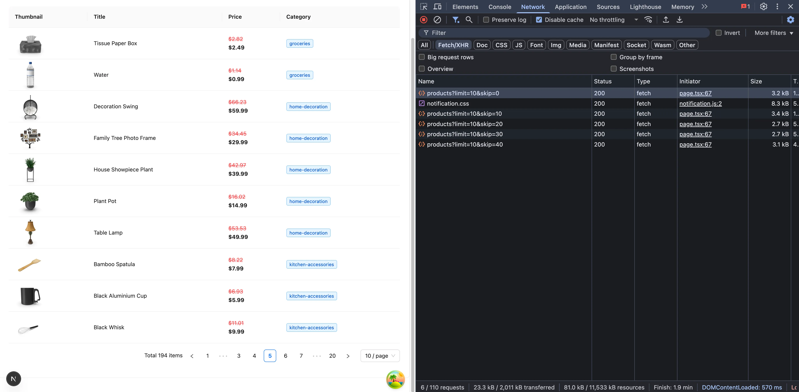
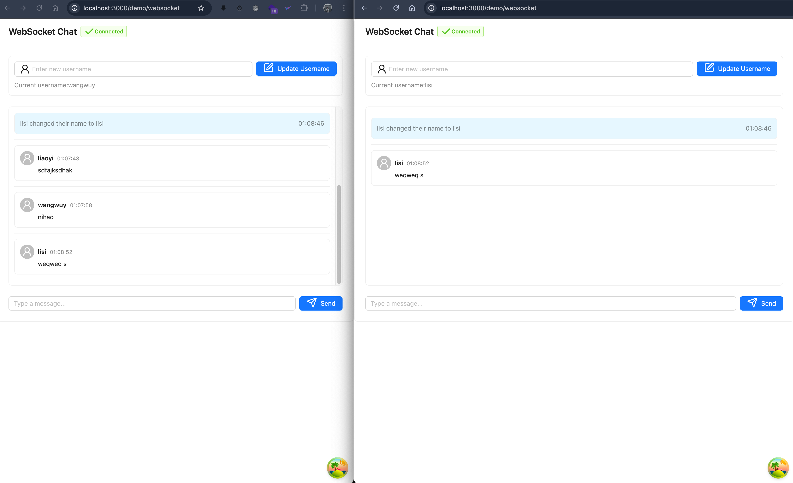

## 前言
在开始前，我想讨论一下**请求状态管理的困境**是什么？

### 过于简朴的网络请求
在使用原生的 `fetch` 请求获取数据时，大家通常会这么写：

```jsx
useEffect(() => {
  fetch('https://api.example.com/students')
    .then((res) => res.json())
    .then((data) => {
      setStudents(data)
    })
}, [])
```

上面的代码虽然很简洁，但只能在 demo 里使用，在真正的生产环境无法接受的，因为你对这个请求没有做任何处理。一旦请求时间过长却没有任何反馈、或者请求出错了但前端没有任何响应，对用户体验来说都是致命打击。

### 过于繁琐的状态处理
所以在日常开发中，我们会再添加 loading 和错误处理逻辑，示例如下：


import BadExample from './examples/01-complicated-state-handling.tsx';

 <CodeDisplay component={<BadExample />}>
  <include lang="tsx" >
   ./examples/01-complicated-state-handling.tsx
  </ include>
</CodeDisplay>


+ 为了处理数据加载状态，写了一大堆 `isLoading` 和 `error` 的判断；
+ 为了实现数据缓存，不得不手动管理 `useState` 和 `useEffect`；
+ 如果为了处理实时数据更新，我还要写更多更复杂的轮询逻辑...


我只是为了处理一个网络请求的衍生逻辑，但代码已经开始变得复杂化，模板化了，这些重复性的工作不仅降低了开发效率，还增加了代码维护的难度！

---

直到我遇到了 [TanStack Query](https://tanstack.com/query/latest) （原 React Query），它彻底改变了我的开发方式。


## 一、什么是 TanStack Query？
一个强大的异步状态管理工具，可以让你少些很多样板代码，功能如下：


+ 数据获取和缓存：自动管理异步数据的获取和缓存，减少不必要的请求。
+ 实时数据更新：支持实时数据更新，通过轮询或 WebSocket 等机制获取最新数据。
+ 自动重新获取：当网络恢复或窗口重新获得焦点时，自动重新获取数据。
+ 分页和无限加载：支持分页和无限滚动，简化处理大数据集的过程。
+ 请求重试：在请求失败时自动重试，增加请求的成功率。
+ 错误处理：提供简单的错误处理机制，便于捕获和处理请求错误。
+ 查询和变更的分离：明确区分数据获取（查询）和数据变更（变更），使代码更清晰。
+ 灵活的查询：支持复杂的查询参数，可以轻松管理不同的数据请求。
+ DevTools：提供开发者工具，便于调试和监控数据状态。


---

**与 React Query 的关系**

React Query 是 v4 以前的叫法，从 v4 起就叫 [TanStack Query](https://tanstack.com/query/latest)。之所以改名字，是因为这个团队这套方案推广到除 React 之外的其他框架中去。到目前（2025年5月）最新的 v5 版本已经支持 React、Vue、Angular、Solid、Svelte 5 大框架。


## 二、快速入门
### 官方示例
TanStack Query 官方也提供了一个使用 react-query 获取 React Query GitHub 统计信息的简单示例；可以[在 StackBlitz 中打开](https%3A%2F%2Fstackblitz.com%2Fgithub%2FTanStack%2Fquery%2Ftree%2Fmain%2Fexamples%2Freact%2Fsimple), 代码如下：


import TanStackQueryDemo from './examples/02-tanstack-query.tsx';

 <CodeDisplay component={<TanStackQueryDemo />}>
  <include lang="tsx" meta={{title: "tanstack-query.tsx"}}>
   ./examples/02-tanstack-query.tsx
  </ include>
</CodeDisplay>


在上面的例子中，给我们展示了 TanStack Query 最核心的几个 API：

+ `QueryClient` 用于管理和配置查询的行为。
+ `QueryClientProvider` 是使用 TanStack Query 的起点，也就是第一步，我们必须要通过 `QueryClient` 创建一个实例并传入到 `QueryClientProvider` 中。
+ `useQuery` 获取数据，当加载数据时，我们可以通过 `isPending` 属性来判断是否数据正在加载中，从而去展示加载时的 UI。其中，我们向 `useQuery` 中传入了 `queryKey` 和 `queryFn`，`queryKey` 用来作为该查询的标识，而 `queryFn` 对应为获取数据的函数。


## 三、基本用法
### 创建第一个查询
在 TanStack Query 中，创建查询非常简单。我们使用 `useQuery` 钩子来发起数据请求。这个钩子接受一个配置对象，其中包含查询键（queryKey）和查询函数（queryFn）。

#### 使用 useQuery 钩子
`useQuery` 钩子的基本结构如下：

```jsx
const { data, isLoading, error } = useQuery({
    queryKey: ['uniqueKey'],
    queryFn: () => fetchData(),
})
```

主要参数说明：

+ `queryKey`：查询的唯一标识符，用于缓存管理
+ `queryFn`：实际获取数据的异步函数
+ `enabled`：控制查询是否自动执行
+ `staleTime`：数据保持新鲜的时间
+ `cacheTime`：数据在缓存中保留的时间

#### 示例代码
让我们看一个实际的例子，展示如何使用 `useQuery` 获取用户数据：


import QueryUserExample from './examples/01-use-query-user.tsx';

 <CodeDisplay component={<QueryUserExample />}>
  <include lang="tsx" >
   ./examples/01-use-query-user.tsx
  </ include>
</CodeDisplay>


### 创建变更请求
除了查询数据，我们经常需要修改数据。TanStack Query 提供了 `useMutation` 钩子来处理数据变更操作。

#### 使用 useMutation 钩子
`useMutation` 钩子的基本结构如下：

```jsx
const mutation = useMutation({
    mutationFn: (newData) => updateData(newData),
    onSuccess: () => {
        // 处理成功后的操作
    },
    onError: (error) => {
        // 处理错误
    }
})
```

主要参数说明：

+ `mutationFn`：执行数据变更的函数
+ `onSuccess`：变更成功后的回调
+ `onError`：发生错误时的回调
+ `onSettled`：无论成功失败都会执行的回调

下面是一个使用 `useMutation` 创建新用户的例子：

import UseMutationExample from './examples/04-use-mutation.tsx';

 <CodeDisplay component={<UseMutationExample />}>
  <include lang="tsx" >
   ./examples/04-use-mutation.tsx
  </ include>
</CodeDisplay>

这个例子展示中：

1. 使用 `useMutation` 创建数据变更操作
2. 处理成功和错误情况
3. 在成功后更新缓存
4. 在表单提交时触发变更
5. 显示加载状态

通过这些基本用法，你可以开始使用 TanStack Query 来处理大多数数据获取和变更的场景。

## 四、查询状态管理
在 TanStack Query 中，每个查询都有其状态，这些状态可以帮助我们更好地管理数据加载、错误处理和用户体验。让我们深入了解这些状态及其使用方法。

### 查询状态
TanStack Query 提供了多个状态标志来帮助我们了解查询的当前状态：

```jsx
const {
    // 返回的数据
    data,           // 默认为 undefined，查询最后一次成功解析的数据
    dataUpdatedAt,  // 查询最近一次返回 "success" 状态的时间戳
    error,          // 默认为 null，查询抛出的错误对象
    errorUpdatedAt, // 查询最近一次返回 "error" 状态的时间戳
    failureCount,   // 查询失败的次数，每次失败递增，成功时重置为 0
    failureReason,  // 查询重试的失败原因，成功时重置为 null
    fetchStatus,    // 获取状态：'fetching'(正在执行) | 'paused'(已暂停) | 'idle'(空闲)
    isError,        // 从 status 派生的布尔值，表示是否发生错误
    isFetched,      // 查询是否已被获取过
    isFetchedAfterMount, // 查询是否在组件挂载后被获取过，可用于不显示任何缓存的旧数据
    isFetching,     // 从 fetchStatus 派生的布尔值，表示是否正在获取数据
    isInitialLoading, // 已废弃，将在下一个大版本中移除，是 isLoading 的别名
    isLoading,      // 查询首次获取是否正在进行中，等同于 isFetching && isPending
    isLoadingError, // 查询首次获取时是否失败
    isPaused,       // 从 fetchStatus 派生的布尔值，表示查询是否被暂停
    isPending,      // 从 status 派生的布尔值，表示是否处于 pending 状态
    isPlaceholderData, // 显示的数据是否为占位数据
    isRefetchError, // 查询重新获取时是否失败
    isRefetching,   // 后台重新获取是否正在进行中，等同于 isFetching && !isPending
    isStale,        // 缓存中的数据是否已失效或超过 staleTime
    isSuccess,      // 从 status 派生的布尔值，表示是否成功获取数据
    promise,        // 一个稳定的 Promise，将解析为查询的数据（需要启用 experimental_prefetchInRender 特性）
    refetch,        // 手动重新获取查询的函数，可配置 throwOnError 和 cancelRefetch 选项
    status,         // 查询状态：'pending'(无缓存数据且查询未完成) | 'error'(查询出错) | 'success'(查询成功)
} = useQuery(
    {
        queryKey,     // 查询的唯一键，用于缓存和重新获取
        queryFn,      // 用于请求数据的函数
        gcTime,       // 未使用/非活动缓存数据在内存中保留的时间（以毫秒为单位）
        enabled,      // 是否自动执行查询
        networkMode,  // 网络模式：'online' | 'always' | 'offlineFirst'
        initialData,  // 初始数据，在查询创建或缓存前使用，默认被视为过期数据
        initialDataUpdatedAt, // 初始数据最后更新的时间戳（毫秒）
        meta,         // 可存储查询相关的额外信息，可在查询可用处访问
        notifyOnChangeProps, // 指定哪些属性变化时触发重新渲染
        placeholderData, // 查询处于 pending 状态时使用的占位数据，不会持久化到缓存
        queryKeyHashFn, // 自定义查询键的哈希函数
        refetchInterval, // 自动重新获取的时间间隔（毫秒）
        refetchIntervalInBackground, // 在后台时是否继续自动重新获取
        refetchOnMount, // 组件挂载时是否重新获取
        refetchOnReconnect, // 网络重连时是否重新获取
        refetchOnWindowFocus, // 窗口获得焦点时是否重新获取
        retry,        // 失败重试次数
        retryOnMount, // 组件挂载时是否重试失败的查询
        retryDelay,   // 重试延迟时间（毫秒）
        select,       // 数据转换函数，用于在返回数据前转换数据
        staleTime,    // 数据保持新鲜的时间（毫秒）
        structuralSharing, // 是否启用结构共享，默认为 true
        subscribed,   // 是否订阅缓存更新，默认为 true
        throwOnError, // 是否在渲染阶段抛出错误并传播到最近的错误边界
    },
    queryClient,     // 自定义 QueryClient 实例，否则使用最近上下文中的实例
)

```

上面这段代码就是 useQuery 的基本结构，也标注了详细的注释，这里就不再赘述了！


### 状态更新和缓存
TanStack Query 提供了多种方式来管理查询状态和缓存：

```jsx
const queryClient = useQueryClient();

// 手动更新缓存
queryClient.setQueryData(['todos'], (oldData) => {
    return oldData.map(todo =>
        todo.id === updatedTodo.id ? updatedTodo : todo
    )
})

// 使查询失效并重新获取
queryClient.invalidateQueries({ queryKey: ['todos'] })

// 预取数据
queryClient.prefetchQuery({
    queryKey: ['todos'],
    queryFn: fetchTodos,
})

```

### 状态同步
当多个组件使用相同的查询时，它们会自动共享状态：

```jsx
// ComponentA.tsx
function ComponentA() {
    const { data } = useQuery({
        queryKey: ['todos'],
        queryFn: fetchTodos,
    })
}

// ComponentB.tsx
function ComponentB() {
    const { data } = useQuery({
        queryKey: ['todos'],
        queryFn: fetchTodos,
    });
    // 自动共享 ComponentA 的数据和状态，如果不想使用 ComponentA 共享的数据和状态，可以继续添加 queryKey
}

```

通过合理使用这些状态管理特性，我们可以构建出更加健壮和用户友好的应用程序

## 五、数据缓存与更新
TanStack Query 的核心特性之一是其强大的缓存机制。它不仅能自动管理缓存，还提供了多种方式来手动控制缓存数据。

### 缓存机制
TanStack Query 使用查询键（Query Key）来标识和存储缓存数据。**当使用相同的查询键时，数据会被自动缓存和共享**。

```jsx
// 使用相同的查询键，数据会被共享
const { data: user1 } = useQuery({
    queryKey: ['user', 1],
    queryFn: () => fetchUser(1)
})

const { data: user2 } = useQuery({
    queryKey: ['user', 1],
    queryFn: () => fetchUser(1)
}) // user2 将使用 user1 的缓存数据

```

### 缓存时间控制
通过 `staleTime` 和 `gcTime` 可以控制数据的缓存行为：

```jsx
const { data } = useQuery({
    queryKey: ['todos'],
    queryFn: fetchTodos,
    staleTime: 5 * 60 * 1000, // 数据在 5 分钟内保持新鲜
    gcTime: 10 * 60 * 1000,   // 未使用的数据在 10 分钟后被垃圾回收
})

```

### 手动更新缓存
TanStack Query 提供了多种方式来手动更新缓存数据：

1. **使用 **`setQueryData`** 直接更新**：

```jsx
const queryClient = useQueryClient();

// 更新单个查询的缓存
queryClient.setQueryData(['todos'], (oldData) => {
    return oldData.map(todo =>
        todo.id === updatedTodo.id ? updatedTodo : todo
    )
})

```

2. **使用 **`invalidateQueries`** 使缓存失效**：

```jsx
// 使特定查询的缓存失效
queryClient.invalidateQueries({ queryKey: ['todos'] })

// 使多个相关查询的缓存失效
queryClient.invalidateQueries({ queryKey: ['todos', 'lists'] })

```

3. **使用 **`prefetchQuery`** 预取数据**：

```jsx
// 预取数据到缓存
queryClient.prefetchQuery({
    queryKey: ['todos'],
    queryFn: fetchTodos,
})

```

### 乐观更新
乐观更新是一种提升用户体验的技术，它假设更新会成功，立即更新 UI，然后在后台进行实际的更新操作：

```jsx
import { Button } from 'antd'
import { useMutation, useQueryClient } from '@tanstack/react-query'

interface Todo {
    id: number
    title: string
    completed: boolean
}

const updateTodo = async (newTodo: Todo) => {
    // Implement the logic to update a todo item
    // For example, you can make a POST request to a server
    const response = await fetch('/api/todos', {
        method: 'POST',
        headers: { 'Content-Type': 'application/json' },
        body: JSON.stringify(newTodo)
    })
    return response.json()
};

export default function TodoList() {
    const queryClient = useQueryClient()

    const mutation = useMutation({
        mutationFn: updateTodo,
        onMutate: async (newTodo) => {
            // 取消任何传出的重新获取
            await queryClient.cancelQueries({ queryKey: ['todos'] })

            // 保存之前的数据
            const previousTodos = queryClient.getQueryData(['todos'])

            // 乐观更新
            queryClient.setQueryData(['todos'], (old: Todo[]) => [...old, newTodo])

            // 返回上下文对象
            return { previousTodos }
        },
        onError: (err, _, context) => {
            console.log('🚀 ~ TodoList ~ err:', err)
            // 如果发生错误，回滚到之前的数据
            if (context?.previousTodos) {
                queryClient.setQueryData(['todos'], context.previousTodos)
            }
        },
        onSettled: () => {
            // 无论成功或失败，都重新获取数据
            queryClient.invalidateQueries({ queryKey: ['todos'] })
        },
    });

    return (
        <div>
            {mutation.isPending ? (
                'Adding todo...'
            ) : (
                <>
                    {mutation.isError ? (
                        <div>An error occurred: {mutation.error.message}</div>

                    ) : null}

                    {mutation.isSuccess ? <div>Todo added!</div> : null}

                    <Button
                        onClick={() => {
                            mutation.mutate({ id: Date.now(), title: 'New Todo', completed: false });
                        }}
                    >
                        Create Todo
                    </Button>

                </>
            )}
        </div>
    )
}

```

### 缓存持久化
在某些情况下，我们可能需要将缓存数据持久化到本地存储：

```jsx
import { persistQueryClient } from '@tanstack/react-query-persist-client';
import { createSyncStoragePersister } from '@tanstack/query-sync-storage-persister';

// 创建持久化存储
const persister = createSyncStoragePersister({
    storage: window.localStorage,
});

// 配置持久化
persistQueryClient({
    queryClient,
    persister,
    maxAge: 1000 * 60 * 60 * 24 // 24 小时
});

```

### 缓存调试
TanStack Query 提供了开发者工具来帮助调试缓存，`@tanstack/react-query-devtools` 就是专门来做调试的，在配置之前，需要先安装：

```jsx
pnpm add @tanstack/react-query-devtools
```

在入口文件的配置如下：

```jsx
import { ReactQueryDevtools } from '@tanstack/react-query-devtools';

function App() {
    return (
        <>
            {/* 你的应用组件 */}
            <ReactQueryDevtools initialIsOpen={false} />
        </>
    );
}

```

配置成功后，默认会在网页的右下角显示一个按钮，效果如下：


通过合理使用这些缓存和更新机制，我们可以：

1. 减少不必要的网络请求
2. 提供更好的用户体验
3. 实现离线功能
4. 优化应用性能

## 六、处理分页和无限滚动
在实际开发中，我们不会一次性把全部数据请求回来，而是进入不同页码时才请求对应的数据。在处理大量数据时，分页和无限滚动是两种常用的数据加载方式。TanStack Query 提供了专门的钩子来处理这些场景。

### 分页查询
TanStack Query 提供了 `useQuery` 钩子来处理分页数据。让我们通过一个商品列表的例子来展示：

import PaginationDemo from './examples/06-pagination.tsx';

 <CodeDisplay component={<PaginationDemo />}>
  <include lang="tsx" >
   ./examples/06-pagination.tsx
  </ include>
</CodeDisplay>


效果图下： 

行上图的右侧 network 面板也能看到，每页请求 10 条数据，已经访问过的页码，不会再次重新请求，主要配置就是 `placeholderData: keepPreviousData,`!

### 无限滚动
对于无限滚动，TanStack Query 提供了 `useInfiniteQuery` 钩子。这个钩子专门用于处理无限加载的数据。在实现无限滚动时，我们通常需要检测元素是否进入视口（viewport），这时就需要用到 `react-intersection-observer` 这个库。

`react-intersection-observer` 是一个 React 组件和钩子，用于检测元素是否进入视口。它基于 [Intersection Observer API](https%3A%2F%2Fdeveloper.mozilla.org%2Fen-US%2Fdocs%2FWeb%2FAPI%2FIntersection_Observer_API)，提供了一种简单的方式来监控元素与视口的交叉状态。

主要特点：

1. 使用简单：提供了 `useInView` 钩子，使用起来非常方便
2. 性能好：基于原生的 Intersection Observer API，性能开销小
3. 可配置：支持多种配置选项，如阈值、根元素等
4. 跨浏览器兼容：自动处理浏览器兼容性问题

基本用法：

```jsx
import { useInView } from 'react-intersection-observer';

function MyComponent() {
    const { ref, inView } = useInView({
        threshold: 0, // 触发阈值，0 表示元素刚进入视口就触发
        triggerOnce: false, // 是否只触发一次
    });

  return (
      <div ref={ref}>
          {inView ? '元素在视口中' : '元素不在视口中'}
      </div>

  );
}

```

在我们的无限滚动实现中，`react-intersection-observer` 用于检测加载更多触发器是否进入视口，从而触发加载下一页数据的操作。

下面是一个使用 `useInfiniteQuery` 和 `react-intersection-observer` 实现的无限滚动商品列表：


import ScrollDemo from './examples/07-Infinite-scrolling.tsx';

 <CodeDisplay component={<ScrollDemo />}>
  <include lang="tsx" >
   ./examples/07-Infinite-scrolling.tsx
  </ include>
</CodeDisplay>

当滚动条划到底部的时就自动去获取下一页的数据，如下图：


### 分页与无限滚动的选择
选择使用分页还是无限滚动取决于具体的应用场景：

1. **分页适用于**：
    - 需要精确控制每页显示数量的场景
    - 需要快速跳转到特定页面的场景
    - 数据量相对较小且结构化的场景
2. **无限滚动适用于**：
    - 内容流式的场景（如社交媒体）
    - 需要持续加载更多内容的场景
    - 移动端应用

### 性能优化建议
1. **使用 **`keepPreviousData`：

```jsx
const { data } = useQuery({
    queryKey: ['products', pagination],
    queryFn: () => fetchProducts(pagination),
    placeholderData: keepPreviousData, // 在加载新数据时保留旧数据
});

```

2. **预取下一页数据**：

```jsx
const queryClient = useQueryClient();

// 预取下一页数据
queryClient.prefetchQuery({
    queryKey: ['products', { page: pagination.page + 1, limit: pagination.limit }],
    queryFn: () => fetchProducts({ page: pagination.page + 1, limit: pagination.limit }),
});

```

3. **使用 **`staleTime`** 控制数据新鲜度**：

```jsx
const { data } = useQuery({
    queryKey: ['products', pagination],
    queryFn: () => fetchProducts(pagination),
    staleTime: 5 * 60 * 1000, // 缓存5分钟数据
});

```


## 七、订阅与实时数据
在实时应用中，我们经常需要处理实时数据更新。TanStack Query 提供了多种方式来处理实时数据，包括轮询、WebSocket 订阅等。下面通过一个商品库存到货通知的例子来展示 TanStack Query 中如何使用 WebSocket。

### WebSocket 服务器实现
下面以简易聊天系统为例，来看看怎么将 TanStack Query 跟 WS 结合起来，最终效果如下：



服务端代码实现如下：

  <include lang="ts" >
   ../../../src/app/(examples)/demo/websocket/websocket-server.ts
  </ include>


使用命令 `npx tsx ./server/websocket.ts` 运行服务端代码如下： 

### 前端实现
前端一共就两个点：连接 WS 和展示用户的信息，现在，让我们创建一个使用 chat 的 React 组件来展示聊天数据：


  <include lang="tsx" >
   ../../../src/app/(examples)/demo/websocket/page.tsx
  </ include>


上面的组件中，引入了一个关键的 Hooks——`useWebSocket`，用于建立一个 WebSocket 连接到指定的 URL 的服务器。这个钩子提供了一系列函数和状态变量来管理连接和与服务器通信。具体功能有：连接管理、状态管理、消息收发、TanStack Query 集成和组件卸载时清理 WebSocket 连接和间隔。代码实现如下：


  <include lang="tsx" >
   ../../../src/app/(examples)/demo/websocket/use-websocket.tsx
  </ include>

### 实现说明
1. **WebSocket 服务器**：
    - 使用 `ws` 库创建 WebSocket 服务器
    - 维护连接的客户端列表
    - 暂存客户端发送的信息
    - 广播更新给所有连接的客户端
2. **前端实现**：
    - 使用 `useQuery` 获取初始数据
    - 使用 `useEffect` 建立 WebSocket 连接
    - 通过 `queryClient.setQueryData` 更新缓存数据
    - 使用 Ant Design 的组件展示数据

这个实现展示了如何使用 WebSocket 和 TanStack Query 来处理实时数据更新。通过这种方式，我们可以：

+ 保持数据的实时性
+ 减少不必要的轮询请求
+ 提供更好的用户体验
+ 优化服务器资源使用

## 八、总结
TanStack Query 是一个强大的数据获取和状态管理库，它通过以下特性显著提升了开发效率和用户体验：

1. **自动缓存管理**：智能处理数据缓存，减少重复请求，提升应用性能。
2. **状态管理简化**：自动处理加载、错误等状态，减少样板代码。
3. **实时数据支持**：通过 WebSocket 等机制支持实时数据更新。
4. **分页与无限滚动**：内置支持分页和无限滚动场景，简化复杂数据加载逻辑。
5. **开发体验优化**：提供 DevTools 等工具，方便调试和监控。

由于篇幅有限，没有概含所有 TanStack Query 的内容，只列举了一些高频的场景，如果感兴趣，可以自行阅读官网！

