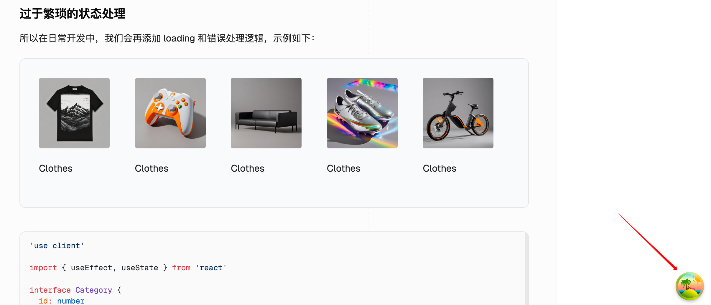
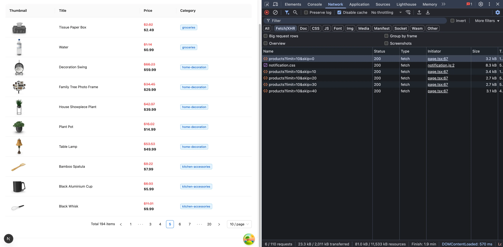
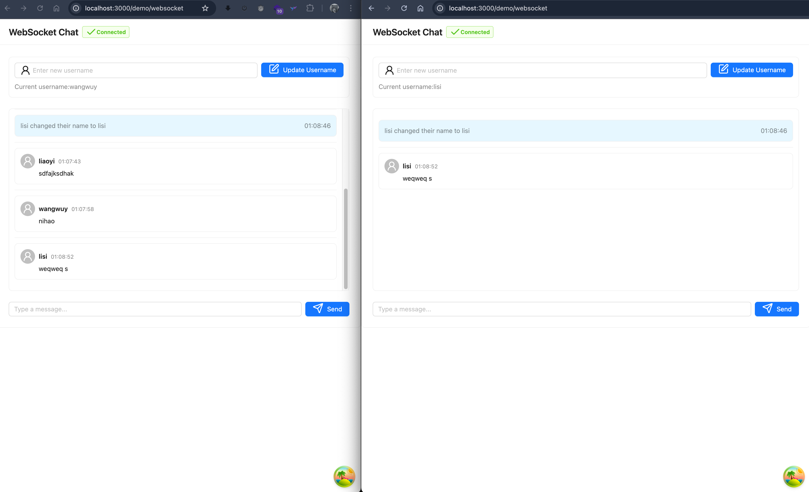
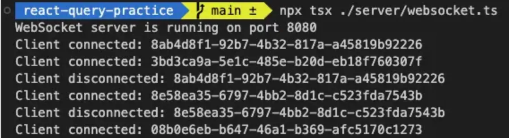

## 前言
在开始前，我想讨论一下**请求状态管理的困境**是什么？

### 过于简朴的网络请求
在使用原生的 `fetch` 请求获取数据时，大家通常会这么写：

```jsx
useEffect(() => {
  fetch('https://api.example.com/students')
    .then((res) => res.json())
    .then((data) => {
      setStudents(data)
    })
}, [])
```

上面的代码虽然很简洁，但只能在 demo 里使用，在真正的生产环境无法接受的，因为你对这个请求没有做任何处理。一旦请求时间过长却没有任何反馈、或者请求出错了但前端没有任何响应，对用户体验来说都是致命打击。

### 过于繁琐的状态处理
所以在日常开发中，我们会再添加 loading 和错误处理逻辑，示例如下：


import BadExample from './examples/01-complicated-state-handling.tsx';

 <CodeDisplay component={<BadExample />}>
  <include lang="tsx" >
   ./examples/01-complicated-state-handling.tsx
  </ include>
</CodeDisplay>


+ 为了处理数据加载状态，写了一大堆 `isLoading` 和 `error` 的判断；
+ 为了实现数据缓存，不得不手动管理 `useState` 和 `useEffect`；
+ 如果为了处理实时数据更新，我还要写更多更复杂的轮询逻辑...


我只是为了处理一个网络请求的衍生逻辑，但代码已经开始变得复杂化，模板化了，这些重复性的工作不仅降低了开发效率，还增加了代码维护的难度！

---

直到我遇到了 [TanStack Query](https://tanstack.com/query/latest) （原 React Query），它彻底改变了我的开发方式。


## 一、什么是 TanStack Query？
一个强大的异步状态管理工具，可以让你少些很多样板代码，功能如下：


+ 数据获取和缓存：自动管理异步数据的获取和缓存，减少不必要的请求。
+ 实时数据更新：支持实时数据更新，通过轮询或 WebSocket 等机制获取最新数据。
+ 自动重新获取：当网络恢复或窗口重新获得焦点时，自动重新获取数据。
+ 分页和无限加载：支持分页和无限滚动，简化处理大数据集的过程。
+ 请求重试：在请求失败时自动重试，增加请求的成功率。
+ 错误处理：提供简单的错误处理机制，便于捕获和处理请求错误。
+ 查询和变更的分离：明确区分数据获取（查询）和数据变更（变更），使代码更清晰。
+ 灵活的查询：支持复杂的查询参数，可以轻松管理不同的数据请求。
+ DevTools：提供开发者工具，便于调试和监控数据状态。


---

**与 React Query 的关系**

React Query 是 v4 以前的叫法，从 v4 起就叫 [TanStack Query](https://tanstack.com/query/latest)。之所以改名字，是因为这个团队这套方案推广到除 React 之外的其他框架中去。到目前（2025年5月）最新的 v5 版本已经支持 React、Vue、Angular、Solid、Svelte 5 大框架。


## 二、快速入门
### 官方示例
TanStack Query 官方也提供了一个使用 react-query 获取 React Query GitHub 统计信息的简单示例；可以[在 StackBlitz 中打开](https%3A%2F%2Fstackblitz.com%2Fgithub%2FTanStack%2Fquery%2Ftree%2Fmain%2Fexamples%2Freact%2Fsimple), 代码如下：


import TanStackQueryDemo from './examples/02-tanstack-query.tsx';

 <CodeDisplay component={<TanStackQueryDemo />}>
  <include lang="tsx" meta={{title: "tanstack-query.tsx"}}>
   ./examples/02-tanstack-query.tsx
  </ include>
</CodeDisplay>


在上面的例子中，给我们展示了 TanStack Query 最核心的几个 API：

+ `QueryClient` 用于管理和配置查询的行为。
+ `QueryClientProvider` 是使用 TanStack Query 的起点，也就是第一步，我们必须要通过 `QueryClient` 创建一个实例并传入到 `QueryClientProvider` 中。
+ `useQuery` 获取数据，当加载数据时，我们可以通过 `isPending` 属性来判断是否数据正在加载中，从而去展示加载时的 UI。其中，我们向 `useQuery` 中传入了 `queryKey` 和 `queryFn`，`queryKey` 用来作为该查询的标识，而 `queryFn` 对应为获取数据的函数。


## 三、基本用法

在 TanStack Query 中，创建查询非常简单。我们使用 `useQuery` 钩子来发起数据请求。这个钩子接受一个配置对象，其中包含查询键（queryKey）和查询函数（queryFn）。


```jsx
const { data, isLoading, error } = useQuery({
    queryKey: any[],
    queryFn: ()=> Promise<any>,
})
```

主要参数说明：

+ `queryKey`：查询的唯一标识符，用于缓存管理
+ `queryFn`：实际获取数据的异步函数 (必须返回一个 Promise)
+ `enabled`：控制查询是否自动执行
+ `staleTime`：数据保持新鲜的时间
+ `cacheTime`：数据在缓存中保留的时间

#### 关于 queryFn

`queryFn` 总是返回一个 Promise，因为 query 并不在乎 `queryFn` 中是否有一个真实的网络请求，query 只在乎 Promise 的状态。

如果用浏览器的 `fetch` 来编写网络请求，`queryFn` 看起来是这样的:

```tsx
queryFn: async () => {
  const response = await fetch(url)
  if (!response.ok) {
    throw new Error(`Error status: ${response.status}`)
  }
  return response.json()
}
```

<Callout type='warn'>
不需要在这里嵌套 `try-catch` ，直接 throw Error 是为了让 query 知道发生了错误。
</Callout>

#### 关于 queryKey

```ts
// id/排序/页码/每页条数/查询关键字 等等都应该放到 query-key 中
useQuery({ queryKey: ['post', id, sort, page, limit, keyword] })

useQuery({ queryKey: ['todos', { status, page }], ... })
useQuery({ queryKey: [{ status, page }, 'todos'], ...})
```

- `queryKey` 是一个数组，通常首位是对状态的简要描述。
- 请求相关的参数都应该放到 `queryKey` 数组中，每当 `queryKey` 变更就会重新执行查询函数。
- 如果 `queryKey` 命中缓存中的 key，会直接返回上次的缓存结果，跳过了阻塞用户操作的 `loading`，提升用户体验。
- `queryKey` 也许会让人联想到 `useEffect` 的依赖列表，但不完全相同， useQuery 会基于 `queryKey` 计算 hash 值，所以你可以大胆的在 `queryKey` 里使用对象和数组，无视对象键值对的顺序。


#### 简单示例
让我们看一个实际的例子，展示如何使用 `useQuery` 获取用户数据：

import QueryUserExample from './examples/01-use-query-user.tsx';

 <CodeDisplay component={<QueryUserExample />}>
  <include lang="tsx" >
   ./examples/01-use-query-user.tsx
  </ include>
</CodeDisplay>


### 创建变更请求
除了查询数据，我们经常还需要创建、修改、更新、删除数据或执行服务器端副作用。为此，TanStack Query 提供了 useMutation 钩子来处理这些数据变更操作。


#### 什么是 Mutation?

所有状态管理工具本质上都是在做两件事: 一个是 `获取数据`，一个是 `修改数据`。
比如 React 中的 `useState` hook，顾名思义，它本质也是一种状态管理。

```ts
const [state, setState] = useState(initialState)
```
其中 `state` 是获取数据，`setState` 用于修改数据。

在 TanStack Query 中，数据获取由 useQuery 负责，而数据修改则由 useMutation 处理。
> 我个人理解，就是为 `POST`/`PUT`/`DELETE` 等请求提供了一个更方便的钩子。


#### 使用 useMutation 钩子
`useMutation` 钩子的基本结构如下：

```jsx
const { mutate, isPending, isSuccess, isError } = useMutation({
  mutationFn: () => {
    return axios.post("/api/user", { name: "jack" })
  },
  onMutate: () => {
    console.log("开始变更")
  },
  onSuccess: () => {
    console.log("变更成功")
  },
  onError: () => {
    console.log("变更失败")
  },
  onSettled: () => {
    console.log("变更完成（成功或失败）")
  }
})
```

主要参数说明：

+ `mutationFn`：执行数据变更的函数
+ `onSuccess`：变更成功后的回调
+ `onError`：发生错误时的回调
+ `onSettled`：无论成功失败都会执行的回调


为什么不用 `axios.post()` 而使用 `useMutation` ?

因为`useMutation` 可以让我们更方便获取状态和拓展功能：

1. 内建状态：如 `isPending`、`isSuccess`、`isError`；
2. 自动重试机制：支持配置 `retry`；
3. 生命周期回调：可以处理 UI 提示、缓存更新等逻辑；
4. 和 `QueryClient` 紧密集成，可直接操作缓存。

<Callout type='warn' >
- 如果 `mutationFn` 中返回的 Promise 为`reject` 状态，那么就算接口请求成功了，`onSuccess` 也不会触发。
- useMutation 的 throwOnError 参数可以控制是否抛出错误，但默认是`false`
- 换句话说，如果 `onSuccess` 一直不触发，请将 throwOnError 设为 true，查看是否报错。
</Callout>


下面是一个使用 `useMutation` 创建新用户的例子：

import UseMutationExample from './examples/04-use-mutation.tsx';

 <CodeDisplay component={<UseMutationExample />}>
  <include lang="tsx" >
   ./examples/04-use-mutation.tsx
  </ include>
</CodeDisplay>

这个例子展示中：

1. 使用 `useMutation` 创建数据变更操作
2. 处理成功和错误情况
3. 在成功后更新缓存
4. 在表单提交时触发变更
5. 显示加载状态

通过这些基本用法，你可以开始使用 TanStack Query 来处理大多数数据获取和变更的场景。

## 四、查询状态管理
在 TanStack Query 中，每个查询都有其状态，这些状态可以帮助我们更好地管理数据加载、错误处理和用户体验。让我们深入了解这些状态及其使用方法。

### 查询状态
TanStack Query 提供了多个状态标志来帮助我们了解查询的当前状态：

```jsx
const {
    // 返回的数据
    data,           // 默认为 undefined，查询最后一次成功解析的数据
    dataUpdatedAt,  // 查询最近一次返回 "success" 状态的时间戳
    error,          // 默认为 null，查询抛出的错误对象
    errorUpdatedAt, // 查询最近一次返回 "error" 状态的时间戳
    failureCount,   // 查询失败的次数，每次失败递增，成功时重置为 0
    failureReason,  // 查询重试的失败原因，成功时重置为 null
    fetchStatus,    // 获取状态：'fetching'(正在执行) | 'paused'(已暂停) | 'idle'(空闲)
    isError,        // 从 status 派生的布尔值，表示是否发生错误
    isFetched,      // 查询是否已被获取过
    isFetchedAfterMount, // 查询是否在组件挂载后被获取过，可用于不显示任何缓存的旧数据
    isFetching,     // 从 fetchStatus 派生的布尔值，表示是否正在获取数据
    isInitialLoading, // 已废弃，将在下一个大版本中移除，是 isLoading 的别名
    isLoading,      // 查询首次获取是否正在进行中，等同于 isFetching && isPending
    isLoadingError, // 查询首次获取时是否失败
    isPaused,       // 从 fetchStatus 派生的布尔值，表示查询是否被暂停
    isPending,      // 从 status 派生的布尔值，表示是否处于 pending 状态
    isPlaceholderData, // 显示的数据是否为占位数据
    isRefetchError, // 查询重新获取时是否失败
    isRefetching,   // 后台重新获取是否正在进行中，等同于 isFetching && !isPending
    isStale,        // 缓存中的数据是否已失效或超过 staleTime
    isSuccess,      // 从 status 派生的布尔值，表示是否成功获取数据
    promise,        // 一个稳定的 Promise，将解析为查询的数据（需要启用 experimental_prefetchInRender 特性）
    refetch,        // 手动重新获取查询的函数，可配置 throwOnError 和 cancelRefetch 选项
    status,         // 查询状态：'pending'(无缓存数据且查询未完成) | 'error'(查询出错) | 'success'(查询成功)
} = useQuery(
    {
        queryKey,     // 查询的唯一键，用于缓存和重新获取
        queryFn,      // 用于请求数据的函数
        gcTime,       // 未使用/非活动缓存数据在内存中保留的时间（以毫秒为单位）
        enabled,      // 是否自动执行查询
        networkMode,  // 网络模式：'online' | 'always' | 'offlineFirst'
        initialData,  // 初始数据，在查询创建或缓存前使用，默认被视为过期数据
        initialDataUpdatedAt, // 初始数据最后更新的时间戳（毫秒）
        meta,         // 可存储查询相关的额外信息，可在查询可用处访问
        notifyOnChangeProps, // 指定哪些属性变化时触发重新渲染
        placeholderData, // 查询处于 pending 状态时使用的占位数据，不会持久化到缓存
        queryKeyHashFn, // 自定义查询键的哈希函数
        refetchInterval, // 自动重新获取的时间间隔（毫秒）
        refetchIntervalInBackground, // 在后台时是否继续自动重新获取
        refetchOnMount, // 组件挂载时是否重新获取
        refetchOnReconnect, // 网络重连时是否重新获取
        refetchOnWindowFocus, // 窗口获得焦点时是否重新获取
        retry,        // 失败重试次数
        retryOnMount, // 组件挂载时是否重试失败的查询
        retryDelay,   // 重试延迟时间（毫秒）
        select,       // 数据转换函数，用于在返回数据前转换数据
        staleTime,    // 数据保持新鲜的时间（毫秒）
        structuralSharing, // 是否启用结构共享，默认为 true
        subscribed,   // 是否订阅缓存更新，默认为 true
        throwOnError, // 是否在渲染阶段抛出错误并传播到最近的错误边界
    },
    queryClient,     // 自定义 QueryClient 实例，否则使用最近上下文中的实例
)

```

上面这段代码就是 useQuery 的基本结构，也标注了详细的注释，这里就不再赘述了！


### 状态更新和缓存

TanStack Query 提供了多种方式来管理查询状态和缓存：

```jsx
const queryClient = useQueryClient();

// 手动更新缓存
queryClient.setQueryData(['todos'], (oldData) => {
    return oldData.map(todo =>
        todo.id === updatedTodo.id ? updatedTodo : todo
    )
})

// 使查询失效并重新获取
queryClient.invalidateQueries({ queryKey: ['todos'] })

// 预取数据
queryClient.prefetchQuery({
    queryKey: ['todos'],
    queryFn: fetchTodos,
})

```

### 状态同步
当多个组件使用相同的查询时，它们会自动共享状态：

```jsx
// ComponentA.tsx
function ComponentA() {
    const { data } = useQuery({
        queryKey: ['todos'],
        queryFn: fetchTodos,
    })
}

// ComponentB.tsx
function ComponentB() {
    const { data } = useQuery({
        queryKey: ['todos'],
        queryFn: fetchTodos,
    });
    // 自动共享 ComponentA 的数据和状态，如果不想使用 ComponentA 共享的数据和状态，可以继续添加 queryKey
}

```

通过合理使用这些状态管理特性，我们可以构建出更加健壮和用户友好的应用程序


## 🧚‍♀️ 数据预加载

> 预加载是一种 "提前加载" 数据的策略，通常用于用户即将访问的数据页面，以减少等待时间、提升交互体验。


### 为什么要预加载？

以一个典型的书籍列表和详情页为例：

1. 用户访问列表页，加载所有书籍标题。
2. 点击任意书名进入详情页。
3. 详情页再次发起请求，加载书籍详情。
4. 回到列表页时重新发起请求，确保数据最新。
5. 用户再次点击书名，又重新加载详情。

### 存在的问题：

- 每次切换页面都需要等待数据加载。
- 用户快速点击，体验受阻。
- 已访问页面的数据重复请求，浪费资源。


### 优化策略：

1. 如果对数据实时性要求没有特别高的话，请求过的详情页和列表页可以缓存起来，不需要每次都重新请求。
2. 当用户鼠标悬浮在列表项上时，可以预先请求数据，等用户点击列表项时，数据已经请求回来并放到缓存中，这样就减少了用户的等待时间。


#### 使用 prefetchQuery 实现预加载

React Query 提供 `queryClient.prefetchQuery()` 方法来执行预加载。

```ts
import { useQueryClient } from "@tanstack/react-query"

const queryClient = useQueryClient();

const handlePrefetch = (id: number) => {
  queryClient.prefetchQuery({
    queryKey: ["book", id],
    queryFn: () => fetchBookDetail(id),
    staleTime: 60 * 1000 // 缓存1分钟，避免频繁请求
  })
}
```

将其绑定到鼠标事件中：

```tsx
<li onMouseEnter={() => handlePrefetch(book.id)}>
  {book.title}
</li>
```

- 通过 `onMouseEnter` 事件来触发预加载
- 通过 `useQueryClient` 来获取 `queryClient.prefetchQuery` 方法来执行预加载。

<Callout type='warn' title="注意" >
记得为 `prefetchQuery` 提供 `staleTime`参数，它表示缓存数据的有效时间，能有效避免过于频繁的网络请求。
</Callout>


#### 使用 placeholderData 占位数据

预加载虽好，但并不能保证用户点击前数据一定已返回。如果用户操作特别快，仍可能看到 loading 状态。

如果我们在列表页已加载过部分基础信息，比如书名、分类、出版社信息，那么详情页完全可以先显示这些内容作为 "占位符"。


示例：使用 `getQueryData` 设置占位数据

```tsx
const useBookDetail = (id: number) => {
  const queryClient = useQueryClient()

  return useQuery({
    queryKey: ["book", id],
    queryFn: () => fetchBookDetail(id),
    placeholderData: () => {
      const list = queryClient.getQueryData<{ id: number }[]>(["book"])
      return list?.find((item) => item.id === id)
    }
  })
}
```

`isPlaceholderData` 标识状态:

React Query 会返回 `isPlaceholderData` 标识当前数据是否为占位符，我们可以据此渲染不同 UI：

```ts
{
    isPlaceholderData ?
      <p>loading...</p>
       :
      <p>{data.description}</p>
}
```


## 五、数据缓存与更新

TanStack Query 的核心特性之一是其强大的缓存机制。它不仅能自动管理缓存，还提供了多种方式来手动控制缓存数据。

### 为什么需要缓存？

在实际业务开发中，频繁的网络请求不仅会增加服务器负担，还会影响用户体验。而很多场景下的数据其实并不需要实时更新，我们可以合理设置缓存时间来降低请求频率。

常见的例子包括：

- 📈 基金收益明细：通常每天只更新一次；
- 👨🏻‍💻 用户头像：只有用户手动修改时才会变化；
- 💬 评论列表：如果对实时性要求不高，半小时更新一次也是可以接受的。


### 缓存机制
TanStack Query 使用查询键（Query Key）来标识和存储缓存数据。**当使用相同的查询键时，数据会被自动缓存和共享**。

```jsx
// 使用相同的查询键，数据会被共享
const { data: user1 } = useQuery({
    queryKey: ['user', 1],
    queryFn: () => fetchUser(1)
})

const { data: user2 } = useQuery({
    queryKey: ['user', 1],
    queryFn: () => fetchUser(1)
}) // user2 将使用 user1 的缓存数据

```

### 如何设置缓存的过期时间 ?
手动管理缓存的生命周期是非常复杂且容易出错的事情，在 TanStack Query 中，我们可以通过 `staleTime` 和 `gcTime` 轻松控制数据的缓存行为：

- `staleTime` 表示数据多久之后会被视 "过期"。在这段时间内，如果再次触发该请求，会直接使用缓存数据，而不会重新发起请求。
- `gcTime` 表示数据在缓存中保留的时间。


```jsx
const { data } = useQuery({
    queryKey: ['todos'],
    queryFn: fetchTodos,
    staleTime: 5 * 60 * 1000, // 数据在 5 分钟内保持新鲜
    gcTime: 10 * 60 * 1000,   // 未使用的数据在 10 分钟后被垃圾回收
})

```

<Callout type='warn' title="建议">
- 默认情况下，`staleTime` 为 `0`，意味着数据在获取后立即进入 "过期" 状态，每次都会重新请求。
- 缓存时间的设置应该根据业务实际情况与产品、后端、测试同学沟通确定，避免拍脑袋式的判断，否则可能导致缓存失效或数据不同步的问题。
</Callout>

### 手动更新缓存
TanStack Query 提供了多种方式来手动更新缓存数据：

1. **使用 **`setQueryData`** 直接更新**：

```jsx
const queryClient = useQueryClient();

// 更新单个查询的缓存
queryClient.setQueryData(['todos'], (oldData) => {
    return oldData.map(todo =>
        todo.id === updatedTodo.id ? updatedTodo : todo
    )
})

```

2. **使用 **`invalidateQueries`** 使缓存失效**：

```jsx
// 使特定查询的缓存失效
queryClient.invalidateQueries({ queryKey: ['todos'] })

// 使多个相关查询的缓存失效
queryClient.invalidateQueries({ queryKey: ['todos', 'lists'] })

```

3. **使用 **`prefetchQuery`** 预取数据**：

```jsx
// 预取数据到缓存
queryClient.prefetchQuery({
    queryKey: ['todos'],
    queryFn: fetchTodos,
})

```

4. **利用回调管理缓存**

可以通过 `onSuccess`、`onError` 等回调在变更完成后更新缓存：

```tsx
const { mutate } = useMutation({
  mutationFn: () => axios.post("/api/user", { name: "jack" })
  onSuccess: (newUser) => {
    toast.success("用户创建成功");

    // 方法 1：创建用户成功后，更新缓存中的用户列表
    queryClient.setQueryData(["users", newUser.id], newUser)

    // 方法 2：创建用户成功后，让之前的缓存数据失效，并重新获取数据（即刷新缓存）
    queryClient.invalidateQueries({ queryKey: ["users"] })
  }
})
```


### 缓存什么时候会自动更新?

需要注意的是，即使缓存已经过期，react-query 也不会立即重新请求，只有在满足以下几种情况时才会触发**自动更新**：

1. `queryKey` 发生变化：例如分页列表中页码变化 (如：`['todo', page]`);
2. 组件重新挂载并订阅了该 query: 例如一个引用了过期缓存的 Modal， Modal 重新渲染时会触发更新缓存；
3. 浏览器窗口重新获取焦点：用户切换标签页返回后；
4. 设备网络断开后重新连接


### 如何关闭自动更新行为？
TanStack Query 默认启用上述刷新机制，但在某些情况下你可能希望手动控制更新行为。

其中三种情况可以手动关闭:

```ts
useQuery({
  queryKey: ['todo', sort],
  queryFn: () => fetchTodo(sort),
  staleTime: 30 * 1000, // 缓存30秒
  refetchOnMount: false,         // 组件挂载时不自动刷新
  refetchOnWindowFocus: false,   // 聚焦窗口时不刷新
  refetchOnReconnect: false,     // 网络重连时不刷新
})
```
- 你也可以通过将 `staleTime` 设置为 `Infinity` 来永不过期，除非手动触发刷新。

**示例：展示数据及更新时间，并手动刷新**

下面是一个小示例，展示如何使用缓存和更新逻辑：

- 使用 useQuery 获取数据；
- 设置 `staleTime` 为 30 秒；
- 显示当前数据和上次更新时间；
- 5 秒后出现 「刷新数据」 按钮，用户可以手动触发更新；
- 观察 `isStale`（数据是否过期）与 isFetching（是否正在请求）状态。

import TodoList from './examples/react-query-cache';

 <CodeDisplay component={<TodoList />}>
  <include lang="tsx" meta={{title: "opacity.tsx"}}>
   ./examples/react-query-cache.tsx
  </ include>
</CodeDisplay>

### 乐观更新
> 乐观更新是一种提升用户体验的技术，它假设更新会成功，立即更新 UI，然后在后台进行实际的更新操作：


<div>正常流程：用户点击 → 显示 loading → 等待后端返回 → 更新状态 （⚠️ 用户体验很不流畅）</div>
<div>乐观更新：用户点击 → 立即更新 UI → 等待后端返回 → 成功则保留，失败则回滚并提示</div>

以下这些场景非常适合使用乐观更新：
- 点赞 / 收藏
- 关注 / 取关
- 评论 / 删除
- 拖拽排序等即时 UI 响应操作


#### 实现思路 onMutate + 回滚

```tsx
onMutate: async ({ targetData }) => {
  const snapshot = queryClient.getQueryData(queryKey)

  // 乐观更新 
  queryClient.setQueryData(queryKey, (oldData) => {
    return newData;
  })

  // 返回一个回滚函数
  return () => queryClient.setQueryData(queryKey, snapshot)
},

onError: (err, variables, rollback) => {
  // rollback 就是 onMutate 的返回值，也就是回滚方法。
  rollback?.()
},

onSettled: () => {
  // 无论接口成功与否，都会执行。我们可以在里面调用 `invalidateQueries`，刷新缓存。
  queryClient.invalidateQueries({ queryKey })
}
```

#### 示例

```jsx
import { Button } from 'antd'
import { useMutation, useQueryClient } from '@tanstack/react-query'

interface Todo {
    id: number
    title: string
    completed: boolean
}

const updateTodo = async (newTodo: Todo) => {
    // Implement the logic to update a todo item
    // For example, you can make a POST request to a server
    const response = await fetch('/api/todos', {
        method: 'POST',
        headers: { 'Content-Type': 'application/json' },
        body: JSON.stringify(newTodo)
    })
    return response.json()
};

export default function TodoList() {
    const queryClient = useQueryClient()

    const mutation = useMutation({
        mutationFn: updateTodo,
        onMutate: async (newTodo) => {
            // 取消任何传出的重新获取
            await queryClient.cancelQueries({ queryKey: ['todos'] })

            // 保存之前的数据
            const previousTodos = queryClient.getQueryData(['todos'])

            // 乐观更新
            queryClient.setQueryData(['todos'], (old: Todo[]) => [...old, newTodo])

            // 返回上下文对象
            return { previousTodos }
        },
        onError: (err, _, context) => {
            console.log('🚀 ~ TodoList ~ err:', err)
            // 如果发生错误，回滚到之前的数据
            if (context?.previousTodos) {
                queryClient.setQueryData(['todos'], context.previousTodos)
            }
        },
        onSettled: () => {
            // 无论成功或失败，都重新获取数据
            queryClient.invalidateQueries({ queryKey: ['todos'] })
        },
    });

    return (
        <div>
            {mutation.isPending ? (
                'Adding todo...'
            ) : (
                <>
                    {mutation.isError ? (
                        <div>An error occurred: {mutation.error.message}</div>

                    ) : null}

                    {mutation.isSuccess ? <div>Todo added!</div> : null}

                    <Button
                        onClick={() => {
                            mutation.mutate({ id: Date.now(), title: 'New Todo', completed: false });
                        }}
                    >
                        Create Todo
                    </Button>

                </>
            )}
        </div>
    )
}
```


#### 封装通用 Hook

若你项目中多次使用乐观更新，可以封装一个统一的 Hook。

> 但我觉得一个项目中涉及到乐观更新的地方其实并不多，基于 `useMutate` 调用`onMutate`，`onError`，`onSettled` 等方法，可以很方便的实现乐观更新。封装了 Hook 后，反而增加了代码的复杂度。

```tsx

type UseOptimisticMutationParams<TData = unknown> = {
  mutationFn: MutationFunction<TData, any>
  queryKey: QueryKey
  updater: (oldData: any) => any
  invalidates?: QueryKey
};

export const useOptimisticMutation = <TData>({
  mutationFn,
  queryKey,
  updater,
  invalidates = queryKey,
}: UseOptimisticMutationParams<TData>) => {
  const queryClient = useQueryClient()

  return useMutation({
    mutationFn,
    onMutate: async () => {
      // 取消任何相关请求，避免覆盖结果
      await queryClient.cancelQueries({ queryKey })

      const snapshot = queryClient.getQueryData(queryKey)
      queryClient.setQueryData(queryKey, updater)

      return () => queryClient.setQueryData(queryKey, snapshot)
    },
    onError: (err, variables, rollback) => {
      rollback?.()
    },
    onSettled: () => {
      queryClient.invalidateQueries({ queryKey: invalidates })
    }
  })
}
```


### 缓存持久化
在某些情况下，我们可能需要将缓存数据持久化到本地存储：

```jsx
import { persistQueryClient } from '@tanstack/react-query-persist-client';
import { createSyncStoragePersister } from '@tanstack/query-sync-storage-persister';

// 创建持久化存储
const persister = createSyncStoragePersister({
    storage: window.localStorage,
});

// 配置持久化
persistQueryClient({
    queryClient,
    persister,
    maxAge: 1000 * 60 * 60 * 24 // 24 小时
});

```

### 缓存调试
TanStack Query 提供了开发者工具来帮助调试缓存，`@tanstack/react-query-devtools` 就是专门来做调试的，在配置之前，需要先安装：

```jsx
pnpm add @tanstack/react-query-devtools
```

在入口文件的配置如下：

```jsx
import { ReactQueryDevtools } from '@tanstack/react-query-devtools';

function App() {
    return (
        <>
            {/* 你的应用组件 */}
            <ReactQueryDevtools initialIsOpen={false} />
        </>
    );
}

```

配置成功后，默认会在网页的右下角显示一个按钮，效果如下：



通过合理使用这些缓存和更新机制，我们可以：

1. 减少不必要的网络请求
2. 提供更好的用户体验
3. 实现离线功能
4. 优化应用性能

## 六、处理分页和无限滚动
在实际开发中，我们不会一次性把全部数据请求回来，而是进入不同页码时才请求对应的数据。在处理大量数据时，分页和无限滚动是两种常用的数据加载方式。TanStack Query 提供了专门的钩子来处理这些场景。


### 分页查询

在日常开发中，分页接口通常接受 page、limit 等参数，并返回如下结构的数据：

```json
{
  "cur_page": 1,
  "total": 500,
  "data": [...]
}
```

最直观的实现是为每一页使用不同的 `queryKey`，例如：

```ts
useQuery({
  queryKey: ['books', page],
  queryFn: () => fetchBooks(page)
})
```

**示例演示**

import PaginationDemo from './examples/06-pagination.tsx';

 <CodeDisplay component={<PaginationDemo />}>
  <include lang="tsx" >
   ./examples/06-pagination.tsx
  </ include>
</CodeDisplay>



行上图的右侧 `network` 面板也能看到，每页请求 `10` 条数据，已经访问过的页码，不会再次重新请求，主要配置就是 `placeholderData` 和 `keepPreviousData` !


### 无限滚动
> 无限滚动场景常用于用户滑动到底部时自动加载下一页，例如博客、商品列表、评论区等。

对于无限滚动，TanStack Query 提供了 `useInfiniteQuery` 钩子。这个钩子专门用于处理无限加载的数据。


#### 基本用法

```ts
const { data, hasNextPage, fetchNextPage } = useInfiniteQuery({
  queryKey: ['books', sort],
  initialPageParam: 1,
  queryFn: ({ pageParam = 1 }) => fetchBooks(sort, pageParam),
  getNextPageParam: (lastPage) => {
    return lastPage.cur_page < lastPage.total
      ? lastPage.cur_page + 1
      : undefined
  }
})
```

渲染分页数据：

```tsx
<ul>
  {data.pages.map((page) =>
    page.data.map((item) => <li key={item.id}>{item.name}</li>)
  )}
</ul>

<button onClick={() => fetchNextPage()} disabled={!hasNextPage}>
  下一页
</button>
```

<Callout type='warn' title="注意" >
上述定义是不准确的，因为还有一种可能是用户向上滚动时，自动加载上一页的数据。所以无限滚动需要支持双向获取数据（比如获取聊天记录）记得为 `prefetchQuery` 提供 `staleTime` 参数，它表示缓存数据的有效时间，能有效避免过于频繁的网络请求。
</Callout>


#### 支持双向加载

需要同时实现 `getPreviousPageParam`:

```tsx
useInfiniteQuery({
  queryKey: ["books", sort],
  initialPageParam: { page: 1 },
  queryFn: ({ pageParam = 1 }) => fetchBooks(sort, pageParam),
   getNextPageParam: (lastPage) => {
    const nextPage = lastPage.cur_page + 1
    return nextPage <= lastPage.total ? { page: nextPage } : undefined
  },
  getPreviousPageParam: (firstPage) => {
    const prevPage = firstPage.cur_page - 1
    return prevPage >= 1 ? { page: prevPage } : undefined
  }
})
```

<Callout type='warn' title="注意" >
- 此时 `useInfiniteQuery` 返回值的 `data` 不再不是 `queryFn` 返回的数据，而是包含多个分页内容的 `pages` 数组。
- `pages` 表示目前已获取的所有页的数据的集合。
- `useInfiniteQuery` 返回的 `refetch` 将会重新请求所有分页数据，而非仅刷新当前页。
- 这是因为当某一页数据发生变更，可能后续（或前面）的每一页都随着发生变更。
</Callout>


#### 示例演示

在实现无限滚动时，我们通常需要检测元素是否进入视口（viewport），这时就需要用到 `react-intersection-observer` 这个库。
`react-intersection-observer` 是一个 React 组件和钩子，用于检测元素是否进入视口。它基于 [Intersection Observer API](https%3A%2F%2Fdeveloper.mozilla.org%2Fen-US%2Fdocs%2FWeb%2FAPI%2FIntersection_Observer_API)，提供了一种简单的方式来监控元素与视口的交叉状态。

主要特点：

1. 使用简单：提供了 `useInView` 钩子，使用起来非常方便
2. 性能好：基于原生的 Intersection Observer API，性能开销小
3. 可配置：支持多种配置选项，如阈值、根元素等
4. 跨浏览器兼容：自动处理浏览器兼容性问题


基本用法：

```jsx
import { useInView } from 'react-intersection-observer';

function MyComponent() {
    const { ref, inView } = useInView({
        threshold: 0, // 触发阈值，0 表示元素刚进入视口就触发
        triggerOnce: false, // 是否只触发一次
    });

  return (
      <div ref={ref}>
          {inView ? '元素在视口中' : '元素不在视口中'}
      </div>

  );
}

```

在我们的无限滚动实现中，`react-intersection-observer` 用于检测加载更多触发器是否进入视口，从而触发加载下一页数据的操作。

下面是一个使用 `useInfiniteQuery` 和 `react-intersection-observer` 实现的无限滚动商品列表：


import ScrollDemo from './examples/07-Infinite-scrolling.tsx';

 <CodeDisplay component={<ScrollDemo />}>
  <include lang="tsx" >
   ./examples/07-Infinite-scrolling.tsx
  </ include>
</CodeDisplay>

当滚动条划到底部的时就自动去获取下一页的数据，如下图：


### 分页与无限滚动的选择
选择使用分页还是无限滚动取决于具体的应用场景：

1. **分页适用于**：
    - 需要精确控制每页显示数量的场景
    - 需要快速跳转到特定页面的场景
    - 数据量相对较小且结构化的场景
2. **无限滚动适用于**：
    - 内容流式的场景（如社交媒体）
    - 需要持续加载更多内容的场景
    - 移动端应用

### 性能优化建议

#### 1. 使用 `placeholderData` 保留上一页数据

似乎平常的 `useQuery` 就可以解决分页的需求，但每次翻页获取新数据都会因为 key 的改变，使` data` 变成空数据，导致页面抖动。

`placeholderData` 支持接收上一次的数据作为参数，这使得我们可以在加载新页时显示上一页内容，从而避免空白闪动。

我们可以利用这一点：让加载新数据时不再直接返回空数据，而是保留上一页的数据，配合一个简单的半透明滤镜效果表明正在加载就可以在保证有响应的同时减少页面抖动：


```tsx
const { data, isPlaceholderData } = useQuery({
  queryKey: ['books', page],
  queryFn: () => fetchBooks(page),
  placeholderData: (prev) => prev
})
```

结合简单样式处理即可实现 「渐隐加载」 的效果：

```tsx
<ul style={{ opacity: isPlaceholderData ? 0.5 : 1 }}>
  {data.data.map((it) => (
    <li key={it.id}>{it.name}</li>
  ))}
</ul>
```

#### 2. 禁用切页按钮以避免异常行为

为了防止重复请求或越界请求，通常我们会想在新数据加载时禁用翻页按钮：

```ts
const { isPlaceholderData } = useBooksQuery(sort, page)

const prevDisabled = page === 1 || isPlaceholderData
const nextDisabled = page === data.total || isPlaceholderData
```


#### 3. 使用 `keepPreviousData`：

```jsx
const { data } = useQuery({
    queryKey: ['products', pagination],
    queryFn: () => fetchProducts(pagination),
    placeholderData: keepPreviousData, // 在加载新数据时保留旧数据
});

```

#### 4. 配合 `prefetchQuery` 预取下一页数据：

我们还可以在进入当前页时，结合上一篇文章介绍的 `prefetchQuery`，预先加载下一页数据，加快翻页响应速度：


```jsx
const queryClient = useQueryClient();

// 预取下一页数据
queryClient.prefetchQuery({
    queryKey: ['products', { page: pagination.page + 1, limit: pagination.limit }],
    queryFn: () => fetchProducts({ page: pagination.page + 1, limit: pagination.limit }),
});

```

```ts
const getBooksQueryOptions = (sort: string, page: number) => ({
  queryKey: ['books', sort, page],
  queryFn: () => fetchBooks(sort, page),
  staleTime: 5 * 60 * 1000 // 缓存 5 分钟
})

const useBooksQuery = (sort: string, page: number) => {
  const queryClient = useQueryClient()
  // 预加载下一页
  useEffect(() => {
    queryClient.prefetchQuery(getBooksQueryOptions(sort, page + 1))
  }, [sort, page])
  return useQuery(getBooksQueryOptions(sort, page))
}
```


#### 5. **使用 **`staleTime`** 控制数据新鲜度**：

```jsx
const { data } = useQuery({
    queryKey: ['products', pagination],
    queryFn: () => fetchProducts(pagination),
    staleTime: 5 * 60 * 1000, // 缓存5分钟数据
});

```


## 七、订阅与实时数据
在实时应用中，我们经常需要处理实时数据更新。TanStack Query 提供了多种方式来处理实时数据，包括轮询、WebSocket 订阅等。下面通过一个商品库存到货通知的例子来展示 TanStack Query 中如何使用 WebSocket。

### WebSocket 服务器实现
下面以简易聊天系统为例，来看看怎么将 TanStack Query 跟 WS 结合起来，最终效果如下：



服务端代码实现如下：

  <include lang="ts" >
   ../../../src/app/(examples)/demo/websocket/websocket-server.ts
  </ include>


使用命令 `npx tsx ./server/websocket.ts` 运行服务端代码如下： 

### 前端实现
前端一共就两个点：连接 WS 和展示用户的信息，现在，让我们创建一个使用 chat 的 React 组件来展示聊天数据：


  <include lang="tsx" >
   ../../../src/app/(examples)/demo/websocket/page.tsx
  </ include>


上面的组件中，引入了一个关键的 Hooks——`useWebSocket`，用于建立一个 WebSocket 连接到指定的 URL 的服务器。这个钩子提供了一系列函数和状态变量来管理连接和与服务器通信。具体功能有：连接管理、状态管理、消息收发、TanStack Query 集成和组件卸载时清理 WebSocket 连接和间隔。代码实现如下：


  <include lang="tsx" >
   ../../../src/app/(examples)/demo/websocket/use-websocket.tsx
  </ include>

### 实现说明
1. **WebSocket 服务器**：
    - 使用 `ws` 库创建 WebSocket 服务器
    - 维护连接的客户端列表
    - 暂存客户端发送的信息
    - 广播更新给所有连接的客户端
2. **前端实现**：
    - 使用 `useQuery` 获取初始数据
    - 使用 `useEffect` 建立 WebSocket 连接
    - 通过 `queryClient.setQueryData` 更新缓存数据
    - 使用 Ant Design 的组件展示数据

这个实现展示了如何使用 WebSocket 和 TanStack Query 来处理实时数据更新。通过这种方式，我们可以：

+ 保持数据的实时性
+ 减少不必要的轮询请求
+ 提供更好的用户体验
+ 优化服务器资源使用


## 八、总结
TanStack Query 是一个强大的数据获取和状态管理库，它通过以下特性显著提升了开发效率和用户体验：

1. **自动缓存管理**：智能处理数据缓存，减少重复请求，提升应用性能。
2. **状态管理简化**：自动处理加载、错误等状态，减少样板代码。
3. **实时数据支持**：通过 WebSocket 等机制支持实时数据更新。
4. **分页与无限滚动**：内置支持分页和无限滚动场景，简化复杂数据加载逻辑。
5. **开发体验优化**：提供 DevTools 等工具，方便调试和监控。

由于篇幅有限，没有概含所有 TanStack Query 的内容，只列举了一些高频的场景，如果感兴趣，可以自行阅读官网！


## 其它

### 竞态请求

竞态请求（Race Condition）是一个常见问题，尤其在组件快速重新请求数据（如搜索框、快速切换页面等）时，**旧请求比新请求晚返回**，却错误地覆盖了新请求的结果。

上述有点抽象，我们想象两个场景：

1. **翻页交互**：有一个支持翻页的表格，如果用户从第一页快速的翻到第十页。此时用户期望看到的是第十页的数据，但我们不能保证第十页的请求一定早于其他页码的请求返回，所以第十页的请求结果可能被其他页码的请求结果覆盖。
2. **搜索功能**：一个自动完成组件，用户输入一部分内容，组件会立即访问远程服务器获取智能补全的提示词。但因为用户输入变更很快，最终显示的提示词可能被延期返回的请求结果覆盖。


#### 常见解决思路

一个简单的处理竞态问题的思路：通过闭包的 `active` 标记来让旧的请求在组件重渲染时不再执行后续逻辑。

```tsx
useEffect(() => {
  let active = true

  const fetchData = async () => {
    const response = await fetch(`https://swapi.dev/api/people/${props.id}/`)
    const newData = await response.json()
    if (active) {
      setFetchedId(props.id)
      setData(newData)
    }
  }

  fetchData()

  return () => { active = false }
}, [props.id])
```

- 每次发起请求都有一个新的 `active` 被创建，只有当 `active` 为 `true` 才会执行网络请求的后续操作。
- 当组件重新渲染或者说页面状态过期的时候 `active` 变成 `false`，这个 `false` 作为网络请求的闭包被缓存到了回调函数中，从而阻止了过期的后续操作。


参考链接 🔗
- [race condition](https://maxrozen.com/race-conditions-fetching-data-react-with-useeffect) 
- [在 Effect 中进行数据请求的替代方案 ｜ React官方文档](https://zh-hans.react.dev/learn/synchronizing-with-effects#what-are-good-alternatives-to-data-fetching-in-effects)


<Callout type='info'>
React Query 会根据 `queryKey` 缓存每一次请求。如果你能保证每一次请求的 `queryKey` 是唯一的，那么就不会发生竞态问题。
</Callout>

## 技巧篇
在实际项目中，我们常常需要根据不同场景对接口请求进行更细致的控制，比如：是否请求、请求顺序、是否轮询等。本文将深入介绍 useQuery 在这些高级场景下的使用方式。

### 条件性请求（Conditional Queries）

有时我们希望只有在满足某个条件时才发起请求，例如搜索关键词存在时才请求搜索结果。

⚠️ 错误示范（违反 Hook 规则）：

```tsx
if (keyword) {
  useQuery({
    queryKey: ['search', keyword],
    queryFn
  })
}
```

✅ 正确写法：通过 enabled 参数控制请求是否启用。

```tsx
useQuery({
  queryKey: ['search', keyword],
  queryFn,
  enabled: !!keyword // keyword 存在时才请求 即：仅当 `enabled` 为 `true` 时，query 才会被触发。
})
```


### 依赖性请求（Dependent Queries）

有些请求依赖于另一个请求的结果，比如根据书名获取书籍信息，再根据书籍 ID 获取评论。

❌ 不推荐：将多个请求写在一个 queryFn 中（耦合性高）

```tsx
useQuery({
  queryKey: ['book', 'comments', bookTitle],
  queryFn: async () => {
    const book = await fetchBook(bookTitle)
    const comments = await fetchBookComments(book.data.id)
    return { book, comments }
  }
})
```

✅ 推荐方式：拆分为多个 query，并通过 enabled 控制请求时机

```tsx
const useBookDetail = (bookTitle: string) =>
  useQuery({
    queryKey: ['book', bookTitle],
    queryFn: () => fetchBook(bookTitle),
    enabled: !!bookTitle
  })

const useBookComments = (bookId?: string) =>
  useQuery({
    queryKey: ['comments', bookId],
    queryFn: () => fetchBookComments(bookId!),
    enabled: !!bookId
  })

const useBookDetailAndComments = (bookTitle: string) => {
  const book = useBookDetail(bookTitle)
  const comments = useBookComments(book.data?.id)
  return { book, comments }
}
```

这样不仅降低了耦合，还能分别缓存和复用每个请求的数据。


### 轮询（Polling）

如果你需要定时请求数据，比如检测支付是否完成，可以使用 `refetchInterval` 参数。

#### 1. 简单轮询：

轮询通常用于那些需要实时性反馈的场景，比如查询用户是否完成支付。

```tsx
useQuery({
  queryKey: ['list', { sort }],
  queryFn,
  refetchInterval: 5000, // 每 5 秒请求一次
});
```

#### 2. 条件轮询：仅在某些状态下持续轮询

`refetchInterval` 也可以是一个函数。
想象这样一个场景：前端通过轮询来得知用户是否完成支付，用户一旦完成支付轮询就该停止。

```tsx
useQuery({
  //...,
  refetchInterval: (query) => {
    if (query.state.data?.finished) {
      return false; // 停止轮询
    }
    return 3000; // 每 3 秒请求一次
  }
})
```

###  🚀 并发请求（Parallel Queries）

#### 1. Promise.all 简单实现（注意失败会中断所有请求）：


```tsx
const queryFn = async (bookId: string) => {
  const [book, comments] = await Promise.all([
    fetchBookDetail(bookId),
    fetchBookComments(bookId)
  ])

  return { book, comments }
}

useQuery({
  queryKey: ['bookWithComments', bookId],
  queryFn
})
```

<Callout type='warn' >
当一些业务场景需要前端并发若干请求时，我们可以在 `queryFn` 里基于 `Promise.all` 来并发请求。
这很好，但会让两个请求耦合在一起。任意请求的失败都会导致整个请求失败，且只有一个缓存 key，不利于细粒度的控制缓存。
</Callout>


##### 2. 使用 `useQueries` 并发多个请求，支持更细粒度控制

```tsx
const ids = [1, 2, 3] // // 基于 ids 并发请求，可以动态控制请求数量

const { data, pending } = useQueries({
  queries: ids.map((id) => ({
    queryKey: ['post', id],
    queryFn: () => fetchPost(id),
  })),
  combine: (results) => ({
    data: results.map((r) => r.data),
    pending: results.some((r) => r.isPending)
  })
})

```

<Callout type='warn' >
上面的代码通过调用 `useQuery` 多次，这也很好，但缺点是不能动态控制请求并发的数量。
</Callout>


#### 3. 多请求并聚合结果示例：

如果你明确并发的请求之间存在逻辑关联，或者需要动态控制并发数量，更推荐使用 `useQueries`。
`useQueries` 的 `queries` 参数是一个数组，数组里的每一项都是一个 `useQuery` 的配置对象。
基于 `combine` 可以实现更复杂的聚合逻辑。


```tsx
const { bookDetail, bookComments, isDetailAndCommentPending } = useQueries({
  queries: [
    {
      queryKey: ['book', selectedBookId],
      queryFn: () => fetchBookDetail(selectedBookId!),
      enabled: !!selectedBookId
    },
    {
      queryKey: ['bookComments', selectedBookId],
      queryFn: () => fetchBookComments(selectedBookId!),
      enabled: !!selectedBookId
    }
  ],
  combine: ([bookDetail, bookComments]) => ({
    bookDetail,
    bookComments,
    isDetailAndCommentPending: bookDetail.isPending || bookComments.isPending
  })
})

```
