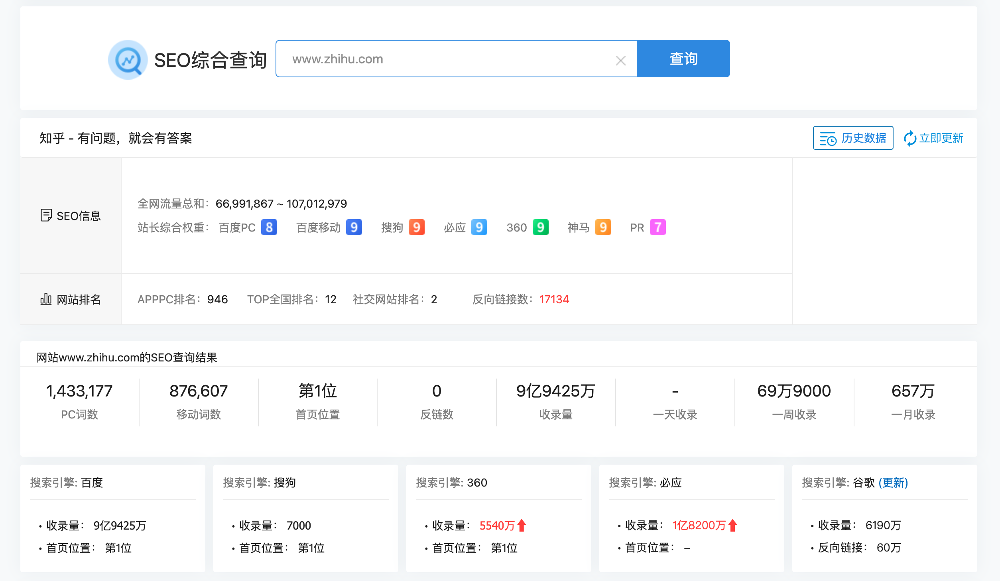
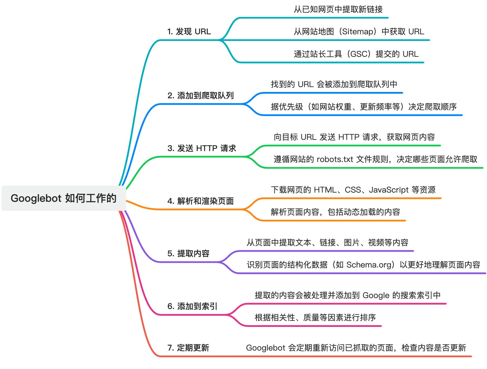
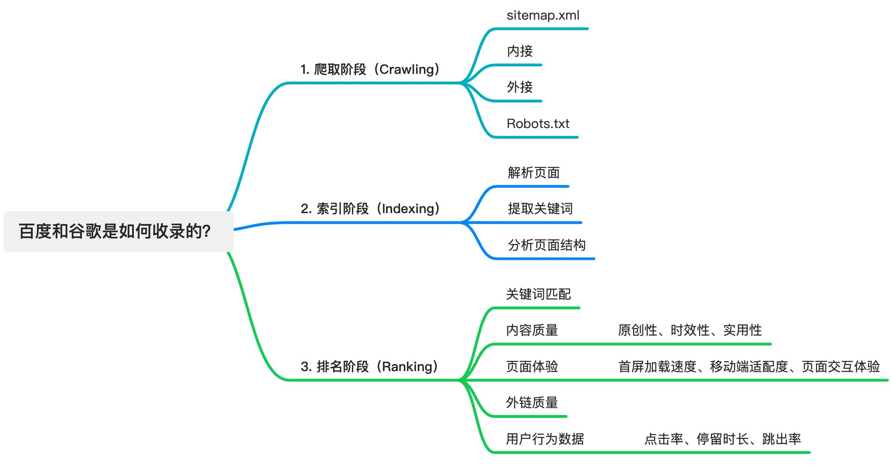
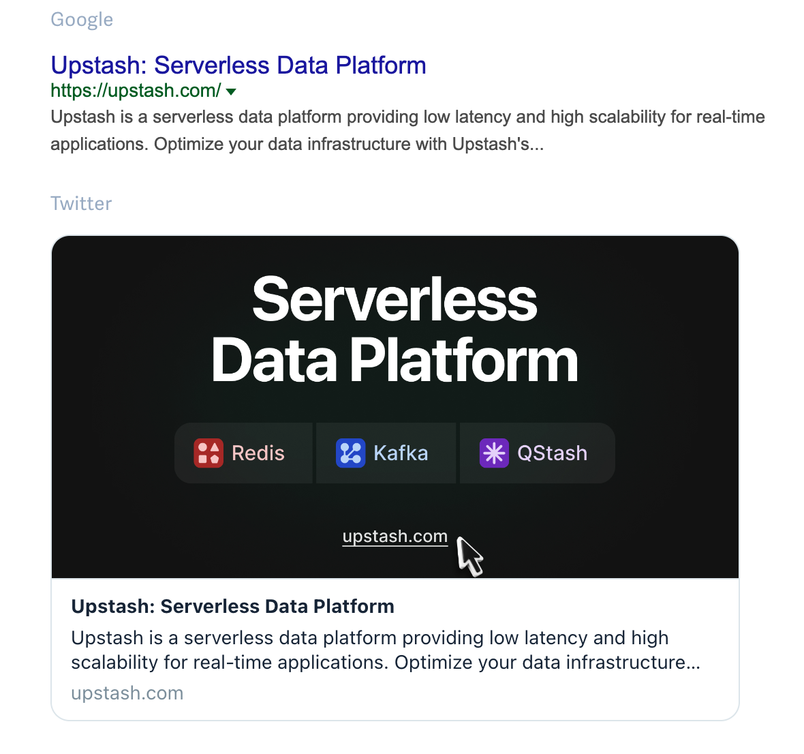
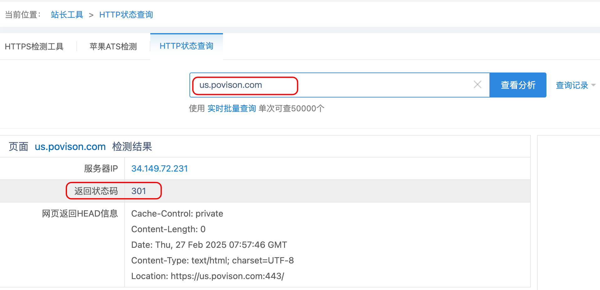
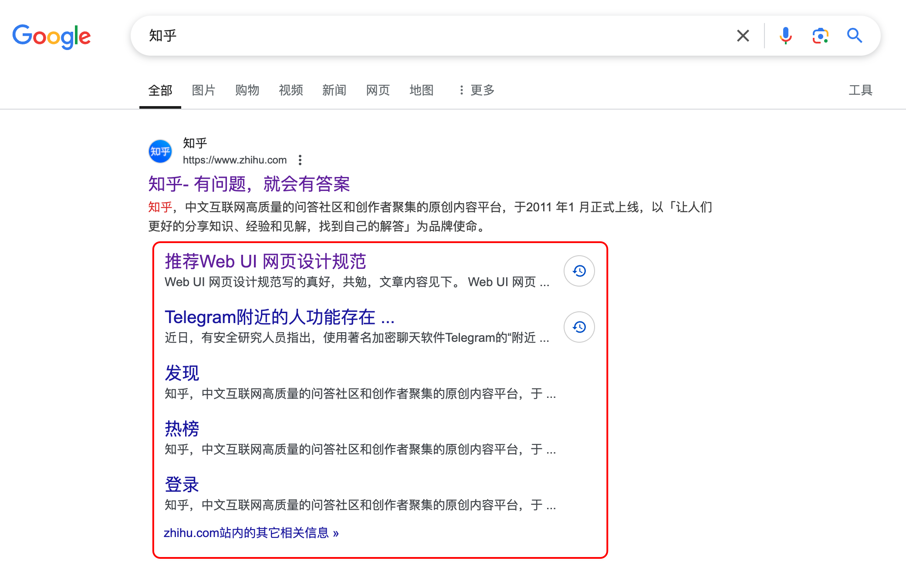
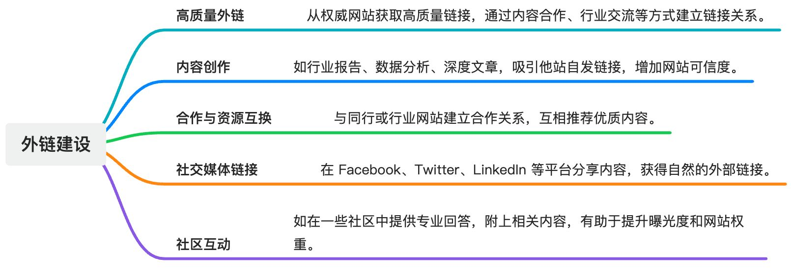

## 什么是 SEO ？

**SEO** (Search Engine Optimization)，即搜索引擎优化。它是一种通过调整网站的 <u>内容、结构、外部链接 </u>等方面的优化手段，来提高网站在搜索引擎自然/免费搜索结果中的排名和可见度的过程。


例如在站长工具： [seo.chinaz.com](https://seo.chinaz.com/www.zhihu.com)，中查看知乎的收录情况：



## 搜索引擎爬取

### Google 搜索引擎爬虫 (Googlebot) 如何工作的？

大致步骤：Find URLs ->> Add to Crawl Queue ->> HTTP Request ->> Render Queue ->> Ready to be indexed



+ 参考： [了解 Googlebot 的工作原理](https://web.dev/blog/javascript-and-google-search-io-2019?hl=zh-cn)


### 百度和谷歌是如何收录的？
搜索引擎收录过程大致相似，分为爬取、索引、排名三个阶段。如下：



## SEO 优化策略


:::info
SEO 优化的策略其实有很多，大体可以分为四大部分，分别为 <u>网站优化</u>、<u>外链建设</u>、<u>网站收录</u>和<u>站外推广</u>。

:::

但如果把网站作为一个产品来推广，从开发和运营的角度出发，全面提升网站可见度的策略如下：

## TDK

TDK 是网站 Title、Description 和 Keywords 的缩写， 是 SEO 的基础设置，直接影响到网页的可见性和搜索结果展示效果。它也是给用户的第一印象，能让<u>搜索引擎更加了解你的网站</u>，同时提高点击率。

### Title
网站标题是最重要的 SEO 元素之一，直接决定了页面在搜索结果中的标题显示，不管是对于搜索引擎或者是访问的用户来说都是必要的。

+ 💡：一个理想的标题包含核心关键词，并具备吸引力，通常在 50-60 个字符内，超出则会被截断。

示例：

```tsx
<title>iPhone 16 Pro and iPhone 16 Pro Max - Apple</title>
```

### Description

页面描述，内容通常会被用作页面的摘要信息展示，直接影响你在搜索结果中的点击率。

+ 💡：合理利用关键词，可以提升用户点击。建议控制在 150-160 字符以内。
+ 💡：内容 **不宜过短**，过短不利于吸引用户点击。

示例：

```tsx
<meta
  name="Description"
  content="iPhone 16 Pro and iPhone 16 Pro Max. Built for Apple Intelligence. Durable titanium design. Camera Control. 4K 120 fps Dolby Vision. A18 Pro chip."
/>
```

### Keywords
页面关键词，虽然搜索引擎不再直接依赖该标签 (现在不重要了)，但合理地添加关键词有助于内容分类和组织，特别是内容管理系统（CMS）可以利用该字段做站内搜索。

+  💡：同页面的关键词应该 **尽量不重复**，避免关键词相互竞争。
+  💡：关键词的数量应控制在 4-8 个，过多可能会被搜索引擎认为是关键词堆砌，影响SEO效果。

示例：

```tsx
<meta name="keywords" content="SEO优化, 站点优化, 网站流量提升">
```


最后：对于不同页面，可设置不同的TDK，来增加关键词的收录量。

---

### Open Graph （社交媒体分享与展示）
> Open Graph 协议是由 Facebook 提出的一种元数据标准，它允许页面成为丰富的社交对象。通过在网页中添加特定的 Open Graph 协议，可以帮助提供更丰富的预览信息。
>

Open Graph 相关标签对搜索排名没有任何好处，它的作用是在复制网址地址分享到社交媒体、私人链接分享时显示一些自定义的网站信息，如图片、标题和描述。

常见的 Open Graph 标签包括：

```typescript
<meta property="og:title" content="页面标题">
<meta property="og:description" content="页面描述">
<meta property="og:image" content="图片URL">
<meta property="og:url" content="页面URL">
<meta property="og:type" content="网页类型，如website，article">
<meta property="og:release_date" content="定义网页内容的发布时间">
```

我们来看下面这个示例：

```html
<!-- Primary Meta Tags -->
<title>Upstash: Serverless Data Platform</title>
<meta name="title" content="Upstash: Serverless Data Platform" />
<meta name="description" content="Upstash is a serverless data platform providing low latency and high scalability for real-time applications. Optimize your data infrastructure with Upstash's managed services for Redis, Vector, QStash, and other key data technologies." />

<!-- Open Graph / Facebook -->
<meta property="og:type" content="website" />
<meta property="og:url" content="https://upstash.com/" />
<meta property="og:title" content="Upstash: Serverless Data Platform" />
<meta property="og:description" content="Upstash is a serverless data platform providing low latency and high scalability for real-time applications. Optimize your data infrastructure with Upstash's managed services for Redis, Vector, QStash, and other key data technologies." />
<meta property="og:image" content="https://metatags.io/images/meta-tags.png" />

<!-- Twitter -->
<meta property="twitter:card" content="summary_large_image" />
<meta property="twitter:url" content="https://upstash.com/" />
<meta property="twitter:title" content="Upstash: Serverless Data Platform" />
<meta property="twitter:description" content="Upstash is a serverless data platform providing low latency and high scalability for real-time applications. Optimize your data infrastructure with Upstash's managed services for Redis, Vector, QStash, and other key data technologies." />
<meta property="twitter:image" content="https://metatags.io/images/meta-tags.png" />

<!-- Meta Tags Generated with https://metatags.io -->
```

效果如下：



在线预览工具链接： [https://metatags.io/?url=https%3A%2F%2Fupstash.com%2F](https://metatags.io/?url=https%3A%2F%2Fupstash.com%2F)

### 其他
有时候在检查网页HTML源代码中看到下面一段 Meta 标签，其实这就是SEO管理的一种方式，在使用 Google 网站管理工具时用来验证网站所有者身份的一种方式,是站长自主添加的一中 Meta 标签属性。

```tsx
<meta name="verify-v1" content="EjkoZwrUyHnlwjyUkbFXVJ2Ioms9m4NTUETFhrIyoNY=" />
```

可以进入 [Google Search  webmasters/tools](http://www.google.com/webmasters/tools/) 中，将自己网站添加进 Google 网站管理，有利于google的收录。

```tsx
<meta name="google-site-verification"  />
```

与上面的 `meta name="verify-v1"` 等效，这是 Google 的网站认证代码，用于证明这个网站的所有者是你。

## HTML 语义化
HTML语义化主要作用有以下几点：

1. 方便其他设备进行解析，例如盲人阅读器 （提示阅读体验）
2. 有利于SEO，搜索引擎更容易理解语义化页面的内容结构和主题
3. 便于团队开发和维护，语义化更具有可读性

---

### 常见语义化标签
标题标签： h1、h2、h3、h4、h5 和 h6

强调标签： strong、em，一方面是强调（加粗/斜体），增加了权重；另一方面增强视觉效果

图片标签： img 标签的 alt 属性有助于图像 SEO，并在网络故障时，代替图片显示。

段落标签： 页面中段落文字可使用 p 标签替代

列表标签： ul、ol、li，更好地理解信息的层次结构和关联性，提高内容和价值

布局标签： header、nav、article、section、aside、footer，根据页面的区域模块划分选择对应的布局标签

### 标题标签优化
HTML 中共有 6 种 h 标签，分别是 h1、h2、h3、h4、h5 和 h6。这些标签表示文字的大小和重要性，h1 最大最重要，h6 最小最次要。相比其他标签，h 标签在页面中的权重非常高，所以使用时要注意不要滥用。


例如：h1 通常用来写网页的主标题，应该与网页 title 标签的内容保持一致，并在页面中展示。每个页面最好只有一个 h1 标签。h2 可用来写次级标题，h3-h6 依次用于更细分的标题。

### 图片标签优化

1. 图片格式：推荐使用 `.webp` 或 `.jpeg` 格式；
2. 图片压缩：压缩图片大小，推荐： [TinyPNG ｜ 图片在线压缩工具](https://tinypng.com/)；
3. 图片添加描述 (Alt 属性): 提升无障碍体验，并且可以被搜索引擎抓取：

```tsx

```

4. 懒加载（Lazy Load） ：对不在首屏的内容延迟加载，确保首屏迅速呈现。

```tsx

```

**页面顶部添加面包屑导航：** 使用户可以清晰看到当前所处位置，便于访问深层次页面及用户操作；

### HTML 语言
设置 HTML 标签的 lang 属性主要用于指定网页内容的语言。对于国际化的项目，设置 lang 属性很有必要，搜索引擎能够将页面准确地展示给搜索相应语言的用户。

### a 标签内链和外链
内链：从自己网站的一个页面指向另外一个页面的链接。

外链：在别的网站导入自己网站的链接，通过外链提升网站权重，提高网站流量，同时需要注意外链的质量，低质量的外链反而会影响到本站的排名。


**注意事项**

1. 在添加内外链的时候，要注意 a 标签中 rel 属性（用于指定当前文档与被链接文档的关系）的使用，下面来看下 nofollow 和 external 两个值的用法：

```html
<a rel="nofollow" href="http://www.baidu.com/">百度</a>
<a rel="external" href="http://www.baidu.com/">百度</a>
<a href="http://www.baidu.com/">百度</a>
```

+ `nofollow`：会告诉搜索引擎**忽略**这个链接，阻止搜索引擎对该页面进行追踪，从而避免权重分散；
+ `external（外部的）`：会告诉搜索引擎这是一个**外部链接**，非本站的链接，它和 target="_blank" 效果一样；
+ `Dofollow`：你可能会在一些工具或者文章中看到  dofollow 这个词，其实默认情况下HTML中的链接都是 dofollow，这些链接都会被搜索引擎爬取。

---

1. **URL 简洁化：** URL 简洁包含关键词，如: `/blog`、 `blog/guide`；
2. **通过内链跳转：** 通过内链连接相关页面，避免死链或重复链接；


> **其它参考文章🔗**： [以掘金示例，利用内链/外链进行网站SEO优化](https://juejin.cn/post/7199567427376562235?searchId=202502251241261C171C605B2A73F7A611)
>


### 网站重定向
#### 301
> 表示本网址永久性转移到另一个地址。
>

301 重定向与网址规范化有着类似的作用，它还具有集中域名权重的作用，比如 url1 重定向到 url2，其实是把 url1 的权重转移到了 url2，从而增加 url2 域名的权重。


虽然 `canonical` 标签可以规范化网址，但是以下四种情况必须配置 301 重定向：

1. 网站替换域名后，旧域名重定向到新域名，弥补流量损失和 SEO
2. 如果删除掉网站中的一些页面，但是这个页面有一定的流量和权重，可以利用 301 重定向到合适的页面避免流量流失；
3. 网站改版或因为其他原因导致页面地址发生变化，为避免出现死链接，也可以通过 301 重定向来解决；


如何验证 301 重定向是否生效呢？可以使用站长工具 -> [HTTP状态查询](https://tool.chinaz.com/pagestatus/?url=us.povison.com) ，查看返回的状态码是否为 301



#### 302
302 表示临时重定向；


### canonical 标签的作用
如果一个页面有多个不同的 URL 地址，但是返回的都是同一个页面，这就是不规范网址，比如下面三个 url 不同，但是打开后是同一个页面：

```plain
https://void0.cn
https://www.void0.cn/
https://www.void0.cn/index.html
```

无论是对搜索引擎还是网站来说，多个 URL 为相同页面，浪费了抓取资源，可能会出现网站重复页面过多一类的因素导致影响收录甚至降权。网页规范化能够解决无意义收录的问题，而且有利于 URL 权重集中。

那么如何实现网址规范化呢？其实很简单，只需在页面的 head 标签中，加入 canonical 属性：

```plain
 <link rel="canonical" href="https://www.void0.com" />
```


其他参考文章： [掘金 ｜ URL地址末尾加不加”/“有什么区别 ？](https://juejin.cn/post/7468112128928350242)

---

### 结构化数据
结构化数据是 HTML 中标记数据的方式，有助于搜索引擎理解网站内容并引导更高质量的搜索结果，搜索引擎可以知道您的页面包含哪些信息以及如何将其呈现给用户。


比如 Google 搜索知乎出现的页面如下：红色框部分就是结构化标记的成果，从框内可以更好的了解该网站的内容，而且占据了大版面也有利于吸引用户注意。




JSON-LD 是结构化数据的一种形式，书写形式可以参考下面的这段代码，更多的 JSON-LD 款式可以参考

[Google 搜索支持的结构化数据标记 ｜ JSON-LD](https://developers.google.com/search/docs/appearance/structured-data/search-gallery?hl=zh-cn)

```html
<script type="application/ld+json">
    {
      "@context": "https://schema.org",
      "@type": "NewsArticle",
      "headline": "Title of a News Article",
      "image": [
        "https://example.com/photos/1x1/photo.jpg",
        "https://example.com/photos/4x3/photo.jpg",
        "https://example.com/photos/16x9/photo.jpg"
       ],
      "datePublished": "2015-02-05T08:00:00+08:00",
      "dateModified": "2015-02-05T09:20:00+08:00",
      "author": [{
          "@type": "Person",
          "name": "Jane Doe",
          "url": "https://example.com/profile/janedoe123"
        },{
          "@type": "Person",
          "name": "John Doe",
          "url": "https://example.com/profile/johndoe123"
      }]
    }
</script>
```

## 站点地图 & 收录优化
网站收录情况直接影响搜索引擎的流量获取。通过 Sitemap.xml 和 Robots.txt 文件优化抓取和索引：

### Sitemap.xml
使用 sitemap.xml 提供页面结构，便于搜索引擎了解网站架构。它是一个网站的全部URL列表集合，为了保证链接的全面性和准确性，应该自动不定期更新 sitemap 站点地图。


sitemap.xml 文件内容格式大致如下：

```xml
<?xml version="1.0" encoding="UTF-8"?>
<urlset xmlns="http://www.sitemaps.org/schemas/sitemap/0.9">
  <url>
    <loc>https://www.example.com/</loc>
    <lastmod>2023-04-26T18:23:17+00:00</lastmod>
    <changefreq>daily</changefreq>
    <priority>1.0</priority>
  </url>
  <url>
    <!-- URL 地址 -->
    <loc>https://www.example.com/about</loc>
    <!-- 页面的最后修改时间 -->
    <lastmod>2023-04-25T10:12:14+00:00</lastmod>
    <!-- 页面的更新频率 -->
    <changefreq>monthly</changefreq>
    <!-- 页面的优先级 -->
    <priority>0.8</priority>
  </url>
</urlset>
```

上面这个示例中，每个 `URL` 标签代表网站中的一个页面，其中：

+ `loc` 标签表示页面的 URL 地址；
+ `lastmod` 标签表示页面的最后修改时间；
+ `changefreq` 标签表示页面的更新频率；
+ `priority` 标签元素表示页面的优先级；

Sitemap 文件通常位于网站的根目录下，网站管理员可以在各个搜索引擎的站点平台提交 sitemap.xml 文件，以帮助搜索引擎更好地索引网站内容，例如：`www.example.com/sitemap.xml`

### Robots.txt
> 通过 robots.txt 限制不需要被抓取的页面（URL），如后台、隐私页面等，优化抓取效率。
>

蜘蛛在访问一个网站时，会首先会检查该网站的根域下是否有一个叫做 `robots.txt`的纯文本文件，这个文件用于限制搜索引擎在您网站上的抓取范围。

```plain
# 网站目录下所有文件均能被所有搜索引擎蜘蛛访问
User-agent: *
Disallow:

# 禁止所有搜索引擎蜘蛛访问网站的任何部分
User-agent: *
Disallow: /

# 禁止所有的搜索引擎蜘蛛访问网站的几个目录
User-agent: *
Disallow: /haha/

# 只允许某个搜索引擎蜘蛛访问
User-agent: Googlebot
Disallow:

# 还可以配置 Sitemap 属性，用于提供网站 sitemap 的 URL 地址
Sitemap: https://xxxx.com/sitemap.xml
```

参考链接： [Robots.txt 编写注意事项](https://juejin.cn/post/7406160036537892879#heading-6)

### 各搜索引擎提交站点收录
除了 robots.txt + sitemap.xml 方式增加网址被收录的可能性外，还可以在各搜索引擎站长平台手动提交网址，以缩短爬虫发现网站链接时间，加快爬虫抓取速度，以下提供几个搜索引擎站长平台：

+ [百度](https://ziyuan.baidu.com/)
+ [Google](https://developers.google.com/search?hl=zh-cn)
+ [Bing](https://www.bing.com/webmasters/about)
+ 其他： [搜狗](https://zhanzhang.sogou.com/)、[360](https://zhanzhang.so.com/)

## 外链建设与内容营销
外部链接是衡量页面权威性的关键因素。优质的外链能提升页面权重和搜索引擎排名。



## SEO 工具推荐
用于网站访问数据做分析，比如流量来源，页面点击 、转化率等：

+ [百度统计](https://tongji.baidu.com/main/overview/demo/overview/index)
+ [谷歌分析 (Google Analytics)](https://analytics.google.com/analytics/web/#/p441506695/reports/intelligenthome)

---

[Google Search Console](https://search.google.com/search-console/welcome)：定期查看流量分析、抓取状态、外链质量等数据，优化站点。

[PageSpeed Insights](https://pagespeed.web.dev/)：评估页面加载速度，提供代码优化建议。

[Screaming Frog SEO Spider](https://www.screamingfrog.co.uk/seo-spider/)：检测网站内部链接、死链、页面重复问题等，便于提升结构优化


一些在线小工具或插件：

+ [站长工具 ｜ HTTP状态查询](https://tool.chinaz.com/pagestatus/)
+ [站长工具 ｜ SEO综合查询](https://seo.chinaz.com/)
+ 【[Sitemaps 在线生成 ｜ 国外工具](https://www.xml-sitemaps.com/) 】  & 【 [Sitemaps 在线生成 ｜ 国内工具](https://sitemap.zhetao.com/)】
+ [【谷歌插件】META SEO inspector ｜ 分析网页SEO信息 （免费）](https://chromewebstore.google.com/detail/meta-seo-inspector/ibkclpciafdglkjkcibmohobjkcfkaef?hl=zh-CN)

## 翻译平台
+ [https://crowdin.com/](https://crowdin.com/) (推荐)
+ [https://poeditor.com/](https://poeditor.com/)
+ [https://app.lokalise.com/](https://app.lokalise.com/)
