## 使用 drawio 绘制动态流程图

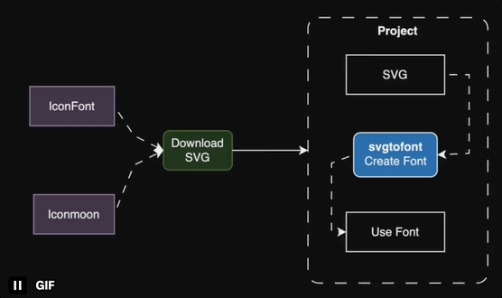

1. 首先打开 [drawio](https://app.diagrams.net/) 在线流程图绘制工具，制作一个自己喜欢的图

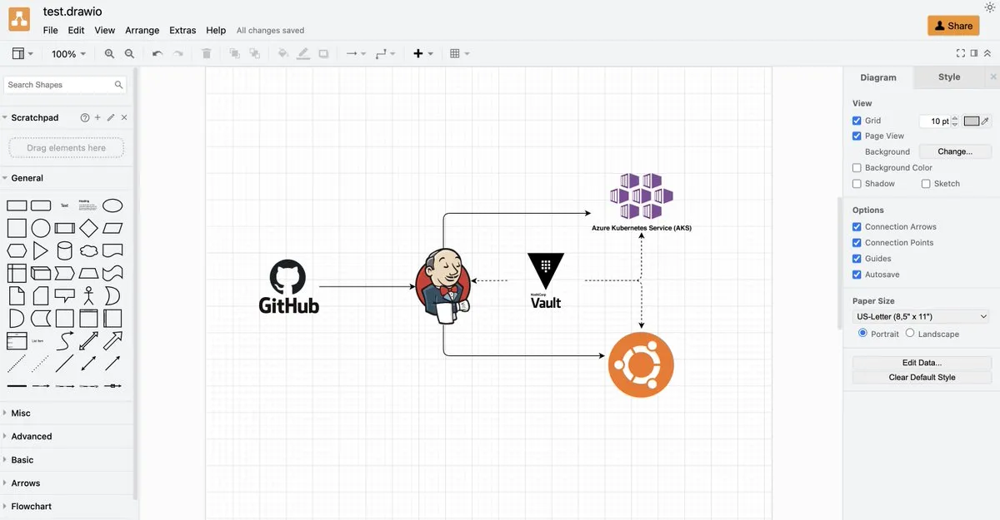

2. 选中图中箭头，给箭头加上 Flow Animation，见图中的红圈

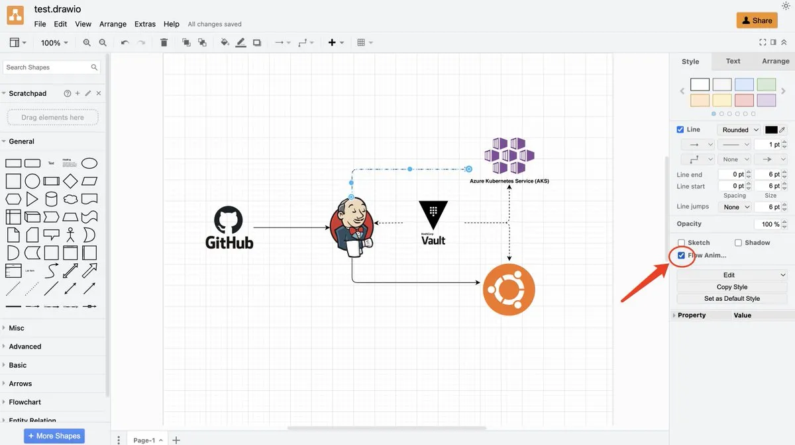

3. 做一下 preview（见图中步骤），就会打开一个新的页面

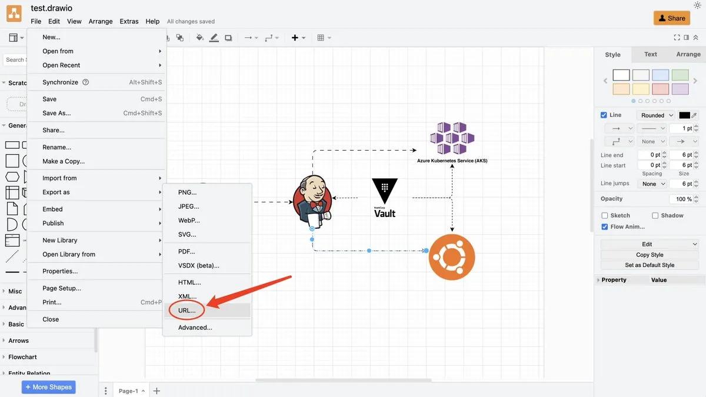

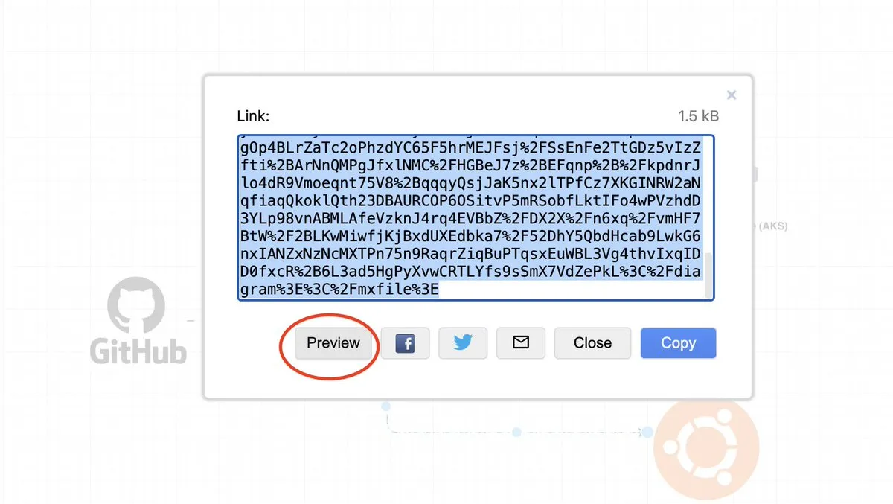

4. 可以直接导出为SVG，并且可以保留动画效果

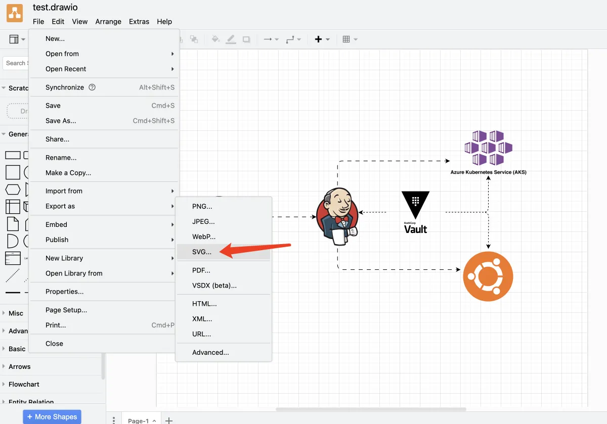

或者任意一个录屏的工具，把动态效果录成 video/GIF。

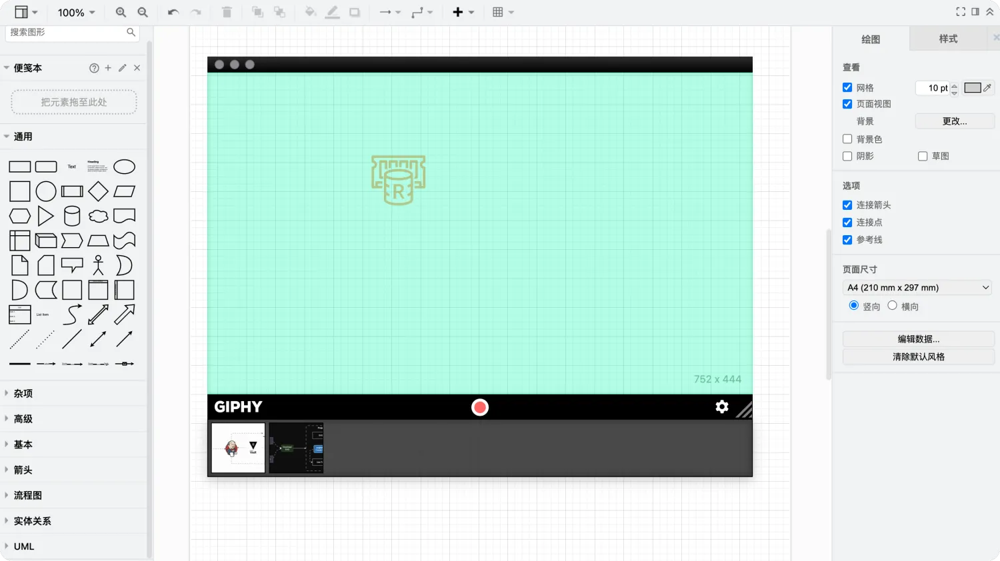

## ASCII 风格流程图

:::info
ASCIIFlow 是上世纪九十年代黑客们最爱的制作流程图表方式，全文本易传播，Geek 风格的反璞归真。ASCII的文本流程图显得简洁明了，可以做到插入灵活，能够节省空间，便于移植，可以用于说明程序实现或者服务构架等等。而且这个工具直接点开网页就可以使用，十分方便！
:::

- 在线工具： https://asciiflow.com/#/

🌰 参考示例图：

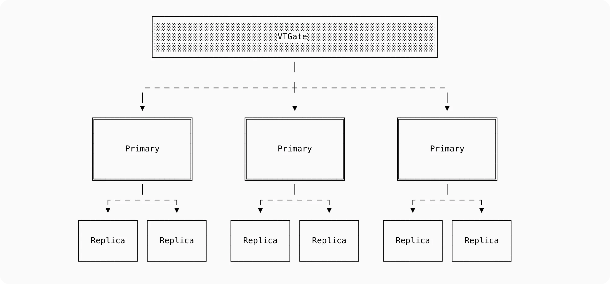
- https://planetscale.com/#vitess

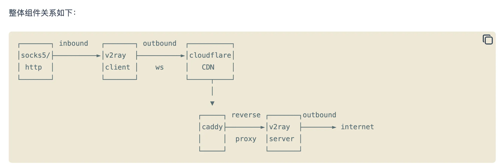
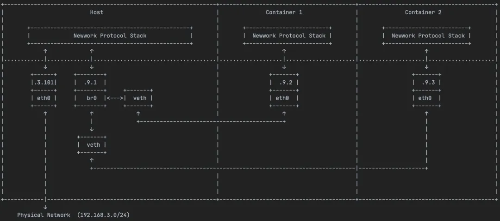

## 3D 流程图绘制

- 在线工具 [icraft](https://icraft.gantcloud.com/zh-CN#features)

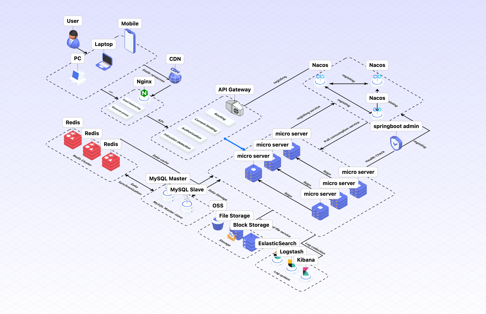
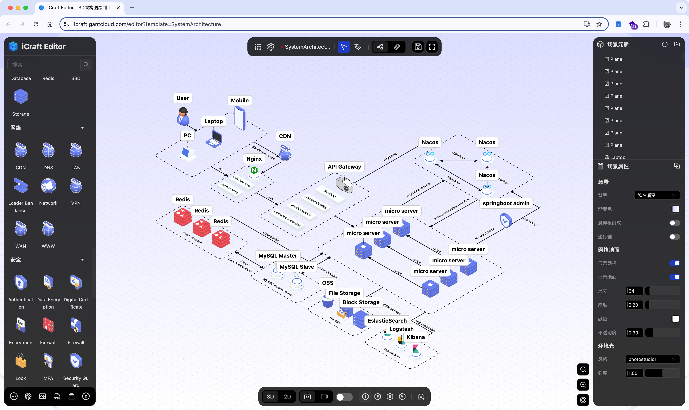

## 其他

<Callout type='warn'>
以下是似乎都是些有点烂尾的项目，目前体验下来都无论是加载速度还是生态都不如刚发布的时候好用。
</Callout>

### 1. onemodel

- 在线工具 [onemodel](https://www.onemodel.app/)

### 2. dezyn

在线工具： https://www.dezyn.io/

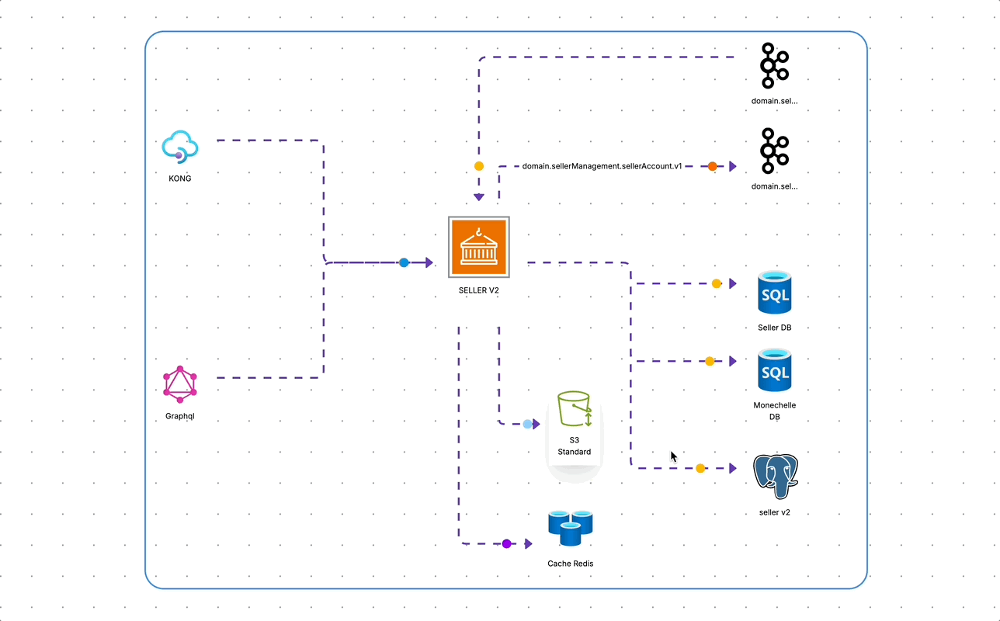

### 3. cloudairy

在线工具： https://app.cloudairy.com/

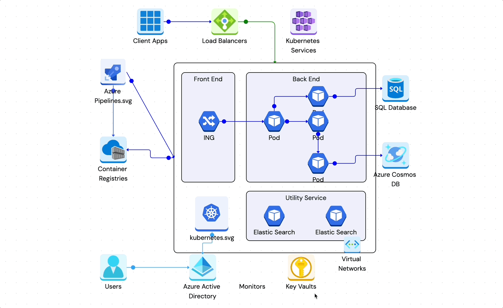