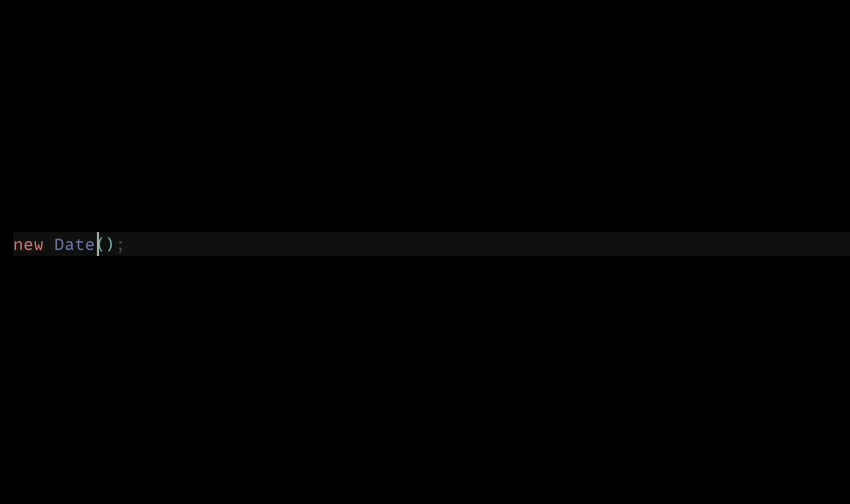
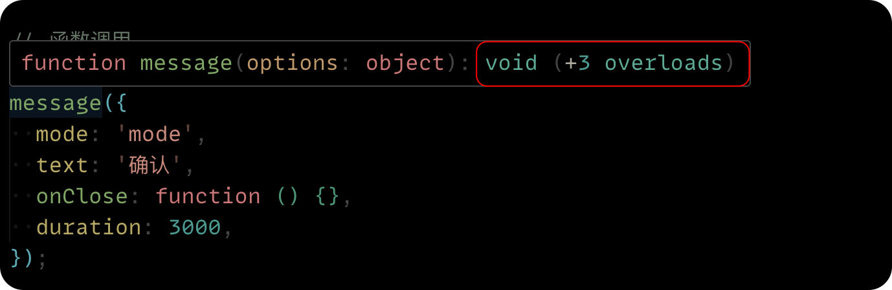
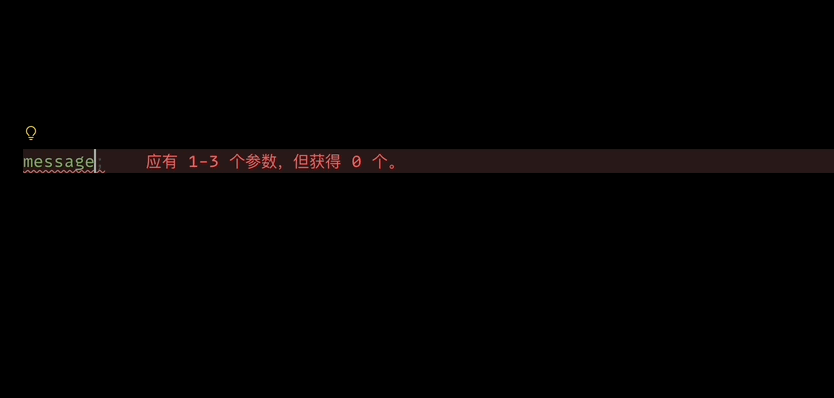

在 JavaScript 里面，当我们去使用一些原生函数的时候，这个函数经常会有多种用法，我们拿 `new Date` 函数来作为例子，它可以传入各种参数，并且还有详细的提示，如下图：


```ts twoslash
new Date()
```



但是到我们自己去实现封装一个函数方法的时候，就完全不一样了，比如下面的代码，我们希望实现一个 `message` 工具方法，这个方法可以传入一个对象、一个函数、也可以有多种传法，从而在使用的时候能够显示这个消息。在开发时，我们可能很容易会把函数定义成下面的样子：

```ts twoslash lineNumbers
//  函数声明
function message(
  params1: string | object,
  params2?: number | Function |string,
  params3?:  Function | string
):void {
  // 函数实现
}


// 函数调用
message({
  mode: 'mode',
  text: '确认',
  onClose: function(){},
  duration: 3000
})
message('text')

message('text', function(){})
message('text', 3000)

message('text', 'mode')
// @errors: 2345
message('text', 'mode', 3000)

message('text',3000, function(){})
```

+ 它有三个参数，可以是字符串、可以是对象，对应的是第二个 12～18 行代码里，传入对象和字符串的使用场景。
+ 第二个参数，可以不传，如果要传的话，可以是数字，也可以是函数，对应 20～21 行代码
+ 但是，第二个参数也可以是字符串，第三个参数也是同理
+ ...


我们先不说这个函数里边怎么实现，单从使用者的角度而言，在使用这个函数的时候，提示就非常不友好了，完全看不出来具体该如果传递产数：

```ts
function message(
  params1: string | object,
  params2?: number | Function | string,
  params3?: Function | string)
: void
```

对于这种需求，我们可以使用 TS 方法重载的方式来实现，就是你声明这个函数的时候，直接了当的告诉它，有哪些参数组合的情况，那如何实现呢？在这个函数定义之前，把它所有传递产数的情况都写出来，先不着急去实现，先声明就行了：

```ts twoslash
//  函数声明
function message(options: object): void
function message(text: string, onClose?: Function): void
function message(text: string, mode: string, duration?: number): void
function message(text: string, duration?: number, onClose?: Function): void

function message(
  params1: string | object,
  params2?: number | Function | string,
  params3?: Function | number
): void {
  // 函数实现
}

// 函数调用
message({
  mode: 'mode',
  text: '确认',
  onClose: function () {},
  duration: 3000
})

message('text')
message('text', function () {})
message('text', 'mode')
message('text', 'mode', 3000)
message('text', 3000)
message('text', 3000, function () {})

```







这是直接声明函数的情况，但是有时候，这个函数不是直接声明的，而是写在某个对象的属性值中的，如下代码：

```ts twoslash
const utils = {
  showMessage(
    params1: string | object,
    params2?: number | Function | string,
    params3?: Function | number
  ) {}
}

// 函数调用
utils.showMessage({
  mode: 'mode',
  text: '确认',
  onClose: function () {},
  duration: 3000
})

utils.showMessage('text')
utils.showMessage('text', function () {})
utils.showMessage('text', 'mode');
utils.showMessage('text', 'mode', 3000)
utils.showMessage('text', 3000);
utils.showMessage('text', 3000, function () {})
```


这种情况我们需要稍微绕一下弯：

+ 先给 utils 对象声明一下类型，里面有一个 showMessage 属性
+ 单独给  showMessage 声明类型，定义<u>接口用于约束函数规格</u>
+ 使用声明的类型，分别给 utils 和 utils.showMessage 约束类型

```ts twoslash
interface ShowMessage {
  (options: object): void
  (text: string, onClose?: Function): void
  (text: string, mode: string, duration?: number): void
  (text: string, duration?: number, onClose?: Function): void
}

interface Utils {
  showMessage: ShowMessage
}

const utils:Utils = {
  showMessage(
    params1: string | object,
    params2?: number | Function | string,
    params3?: Function | number
  ):void {}
}

// 函数调用
utils.showMessage({
  mode: 'mode',
  text: '确认',
  onClose: function () {},
  duration: 3000
})

utils.showMessage('text')
utils.showMessage('text', function () {})
utils.showMessage('text', 'mode');
utils.showMessage('text', 'mode', 3000)
utils.showMessage('text', 3000)
utils.showMessage('text', 3000, function () {})
```

